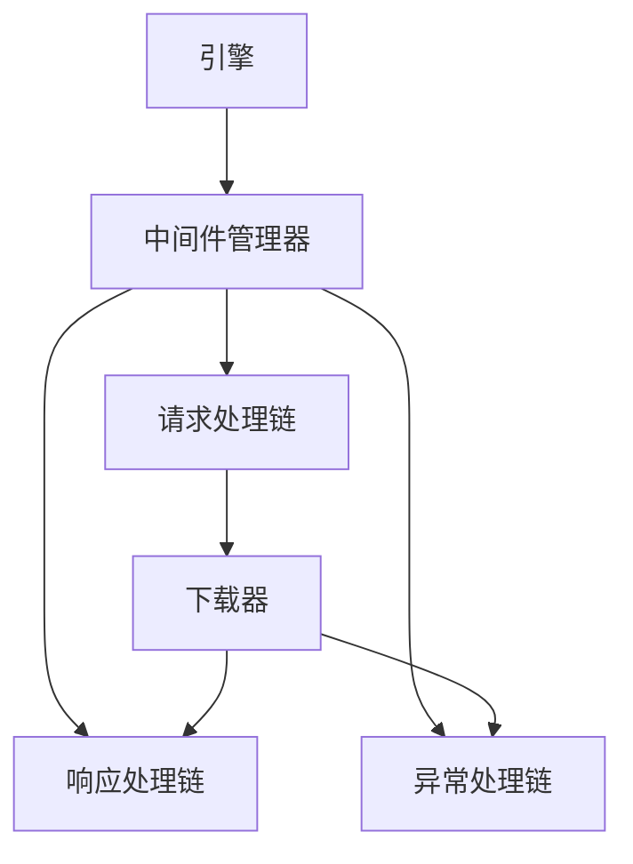

# 中间件模块

中间件模块提供了一个灵活的系统，用于在爬取过程中处理请求和响应。中间件组件可以在请求发送前修改请求，接收响应后处理响应，并处理下载过程中发生的异常。

## 目录
- [MiddlewareManager](manager.md) - 核心中间件管理系统
- [内置中间件](built_in.md) - 内置中间件组件概述
- [代理中间件](proxy.md) - 代理中间件详细说明

## 概述

中间件组件是一个强大功能，允许您在请求/响应处理周期的各个阶段插入自定义逻辑。它们提供以下钩子：

1. **请求处理**：在请求发送到下载器之前修改请求
2. **响应处理**：在响应接收后处理响应
3. **异常处理**：处理下载过程中发生的异常

## 架构



## 主要特性

- **链式处理**：多个中间件组件可以链接在一起
- **灵活钩子**：钩入请求、响应和异常处理
- **易于配置**：通过设置启用/禁用中间件
- **性能优化**：异步处理，开销最小

## 内置中间件

Crawlo提供了几个内置中间件组件：

| 中间件 | 用途 |
|--------|------|
| `RequestIgnoreMiddleware` | 过滤不需要的请求 |
| `DownloadDelayMiddleware` | 在请求之间添加延迟 |
| `DefaultHeaderMiddleware` | 为请求添加默认头部 |
| `ProxyMiddleware` | 处理代理配置（复杂版） |
| `SimpleProxyMiddleware` | 处理代理配置（简化版） |
| `RetryMiddleware` | 为失败请求实现重试逻辑 |
| `ResponseCodeMiddleware` | 处理HTTP响应码 |

## 配置

中间件组件在项目的[settings.py](https://github.com/crawl-coder/Crawlo/blob/master/examples/api_data_collection/api_data_collection/settings.py)中配置：

```python
MIDDLEWARES = [
    'crawlo.middleware.request_ignore.RequestIgnoreMiddleware',
    'crawlo.middleware.download_delay.DownloadDelayMiddleware',
    'crawlo.middleware.default_header.DefaultHeaderMiddleware',
    # 选择使用复杂版或简化版代理中间件
    # 'crawlo.middleware.proxy.ProxyMiddleware',        # 复杂版代理中间件
    'crawlo.middleware.simple_proxy.SimpleProxyMiddleware',  # 简化版代理中间件
    'crawlo.middleware.retry.RetryMiddleware',
    'crawlo.middleware.response_code.ResponseCodeMiddleware',
]
```

## 中间件处理流程

1. **请求处理**：按顺序调用每个中间件的[process_request](https://github.com/crawl-coder/Crawlo/blob/master/crawlo/middleware/base.py#L22)方法
2. **下载**：请求发送到下载器
3. **响应处理**：按相反顺序调用每个中间件的[process_response](https://github.com/crawl-coder/Crawlo/blob/master/crawlo/middleware/base.py#L28)方法
4. **异常处理**：如果发生异常，则调用[process_exception](https://github.com/crawl-coder/Crawlo/blob/master/crawlo/middleware/base.py#L35)方法

## 代理中间件选择指南

Crawlo框架提供了两种代理中间件实现：

1. **ProxyMiddleware（复杂版）**：
   - 动态从API获取代理
   - 代理池管理
   - 健康检查和成功率统计
   - 复杂的代理提取逻辑
   - 适用于需要高级代理管理功能的场景

2. **SimpleProxyMiddleware（简化版）**：
   - 基于固定代理列表的简单实现
   - 轻量级，代码简洁
   - 易于配置和使用
   - 适用于只需要基本代理功能的场景

详细信息请参阅[代理中间件文档](proxy.md)。

## 创建自定义中间件

要创建自定义中间件，请继承[BaseMiddleware](https://github.com/crawl-coder/Crawlo/blob/master/crawlo/middleware/base.py#L9)并实现所需的方法：

```python
from crawlo.middleware import BaseMiddleware

class CustomMiddleware(BaseMiddleware):
    def process_request(self, request, spider):
        # 在发送前修改请求
        return None  # 继续处理
    
    def process_response(self, request, response, spider):
        # 接收后处理响应
        return response  # 返回处理后的响应
    
    def process_exception(self, request, exception, spider):
        # 处理异常
        return None  # 让异常传播
```

有关中间件管理器和特定中间件实现的详细信息，请参阅单独的文档页面。