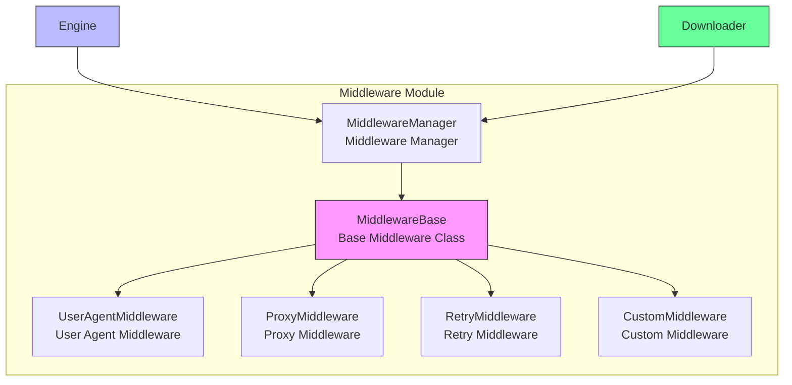

# Middleware Module

The middleware module is the component in the Crawlo framework responsible for processing requests and responses. It provides a hook mechanism that allows users to execute custom logic before requests are sent and after responses are returned.

## Module Overview

The middleware module adopts a plugin-based design, supporting multiple middleware implementations. Users can extend framework functionality by configuring a middleware list to implement custom logic for request processing, response processing, error handling, etc.

### Core Components

1. [MiddlewareManager](manager_en.md) - Middleware manager
2. [Built-in Middlewares](built_in_en.md) - Built-in middlewares provided by the framework
3. [Custom Middlewares](custom_en.md) - User-defined middlewares

## Architecture Design



## Middleware Types

### UserAgentMiddleware

**Function:**
- Add user agent headers to requests
- Support random user agents

**Configuration Options:**
```python
# Set user agent
USER_AGENT = 'Mozilla/5.0 (Windows NT 10.0; Win64; x64) AppleWebKit/537.36'

# Use random user agent
RANDOM_USER_AGENT = True
```

### ProxyMiddleware

**Function:**
- Add proxy support to requests
- Support proxy rotation

**Configuration Options:**
```python
# Set proxy
PROXY = 'http://127.0.0.1:8080'

# Use proxy list
PROXY_LIST = [
    'http://proxy1:8080',
    'http://proxy2:8080',
    'http://proxy3:8080'
]
```

### RetryMiddleware

**Function:**
- Automatically retry failed requests
- Support multiple retry conditions

**Configuration Options:**
```python
# Set maximum retry times
MAX_RETRY_TIMES = 3

# Set retry status codes
RETRY_STATUS_CODES = [500, 502, 503, 504, 429]
```

## Configuration Options

The middleware module's behavior can be adjusted through the following configuration options:

| Configuration Item | Type | Default Value | Description |
|--------------------|------|---------------|-------------|
| MIDDLEWARES | list | [] | Middleware list |
| USER_AGENT | str | '' | User agent string |
| RANDOM_USER_AGENT | bool | False | Whether to use random user agent |
| PROXY | str | None | Proxy address |
| PROXY_LIST | list | [] | Proxy list |
| MAX_RETRY_TIMES | int | 3 | Maximum retry times |
| RETRY_STATUS_CODES | list | [500, 502, 503, 504, 429] | Retry status codes |

## Usage Examples

### Configure Middlewares

```python
# Configure middlewares in configuration file
MIDDLEWARES = [
    'crawlo.middleware.UserAgentMiddleware',
    'crawlo.middleware.ProxyMiddleware',
    'crawlo.middleware.RetryMiddleware',
]

# Configure middleware parameters
USER_AGENT = 'MyCrawler/1.0'
PROXY = 'http://proxy.example.com:8080'
MAX_RETRY_TIMES = 5
```

### Create Custom Middleware

```python
from crawlo.middleware import MiddlewareBase

class CustomMiddleware(MiddlewareBase):
    def process_request(self, request, spider):
        """Process request"""
        # Execute custom logic before request is sent
        request.headers['X-Custom-Header'] = 'custom-value'
        return request
    
    def process_response(self, request, response, spider):
        """Process response"""
        # Execute custom logic after response is returned
        if response.status_code == 403:
            # Handle 403 error
            self.logger.warning(f"Access denied: {request.url}")
        return response
    
    def process_exception(self, request, exception, spider):
        """Process exception"""
        # Handle request exceptions
        self.logger.error(f"Request exception: {request.url}, Error: {exception}")
        return None
```

## Execution Order

Middlewares are executed in the order of the configuration list:

1. **Request Processing Phase** - Execute [process_request](../../api/crawlo_middleware.md#process_request) method from top to bottom
2. **Response Processing Phase** - Execute [process_response](../../api/crawlo_middleware.md#process_response) method from bottom to top
3. **Exception Processing Phase** - Execute [process_exception](../../api/crawlo_middleware.md#process_exception) method from bottom to top

## Performance Optimization

### Middleware Selection

```python
# Only configure needed middlewares
MIDDLEWARES = [
    'crawlo.middleware.UserAgentMiddleware',  # Only configure when needed
    'crawlo.middleware.RetryMiddleware',      # Only configure when retry is needed
]
```

### Async Support

```python
class AsyncMiddleware(MiddlewareBase):
    async def process_request(self, request, spider):
        """Async process request"""
        # Async operations
        await self.async_operation()
        return request
```

## Error Handling

### Middleware Exception Handling

```python
def process_request(self, request, spider):
    try:
        # Processing logic
        return request
    except Exception as e:
        self.logger.error(f"Middleware processing failed: {e}")
        # Can choose to continue processing or raise exception
        return request
```

## Monitoring and Logging

The middleware module integrates detailed monitoring and logging functionality:

```python
# Log middleware operations
logger.info(f"Middleware processing request: {request.url}")
logger.debug(f"Middleware adding headers: {request.headers}")

# Log exception information
logger.error(f"Middleware execution failed: {e}")
```

## Best Practices

### Reasonable Middleware Configuration

```python
# Production environment configuration
MIDDLEWARES = [
    'crawlo.middleware.UserAgentMiddleware',
    'crawlo.middleware.ProxyMiddleware',
    'crawlo.middleware.RetryMiddleware',
]

# Development environment configuration
MIDDLEWARES = [
    'crawlo.middleware.UserAgentMiddleware',
]
```

### Middleware Performance Optimization

```python
class EfficientMiddleware(MiddlewareBase):
    def __init__(self, settings):
        super().__init__(settings)
        # Preprocess settings to avoid repeated calculations
        self.cached_data = self.preprocess_settings()
    
    def process_request(self, request, spider):
        # Use cached data to avoid repeated calculations
        request.metadata['cached'] = self.cached_data
        return request
```

### Exception Handling Best Practices

```python
def process_exception(self, request, exception, spider):
    """Best practices for exception handling"""
    # Log detailed error information
    self.logger.error(f"Request failed: {request.url}", exc_info=True)
    
    # Take different measures based on exception type
    if isinstance(exception, asyncio.TimeoutError):
        # Handle timeout exception
        request.retry_times += 1
        if request.retry_times < self.settings.MAX_RETRY_TIMES:
            return request  # Re-queue for retry
    
    # Return None for other exceptions, no retry
    return None
```