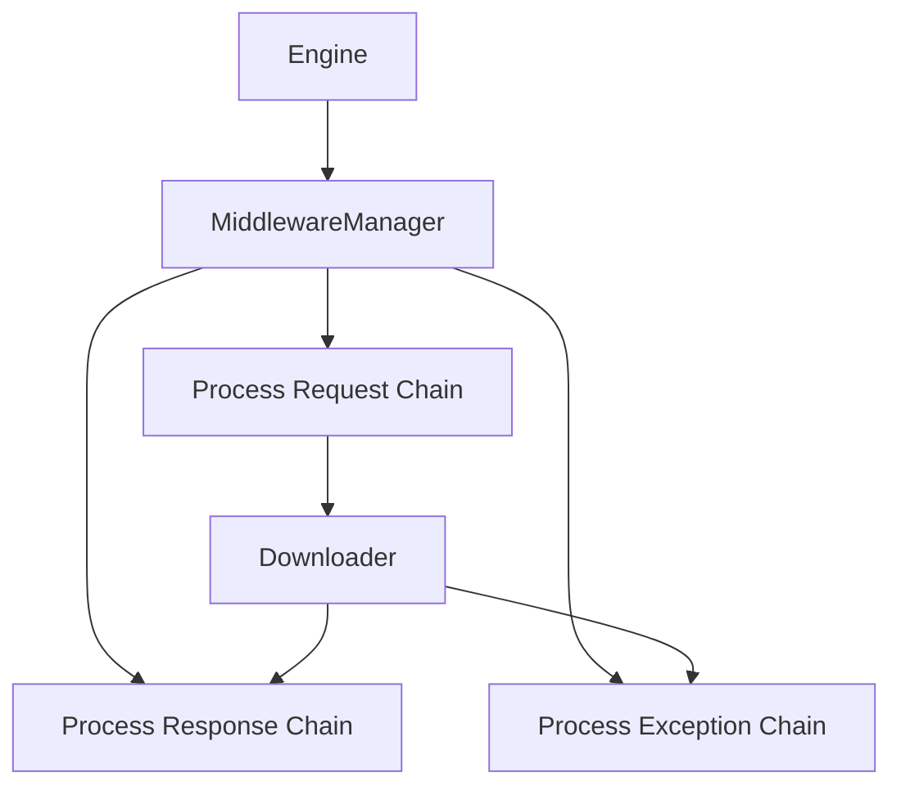

# Middleware Module

The middleware module provides a flexible system for processing requests and responses during the crawling process. Middleware components can modify requests before they are sent, process responses after they are received, and handle exceptions that occur during downloading.

## Table of Contents
- [MiddlewareManager](manager_en.md) - Core middleware management system
- [Built-in Middlewares](built_in_en.md) - Overview of built-in middleware components

## Overview

Middleware components are a powerful feature that allows you to plug in custom logic at various stages of the request/response processing cycle. They provide hooks for:

1. **Request Processing**: Modify requests before they are sent to the downloader
2. **Response Processing**: Process responses after they are received
3. **Exception Handling**: Handle exceptions that occur during downloading

## Architecture



## Key Features

- **Chained Processing**: Multiple middleware components can be chained together
- **Flexible Hooks**: Hook into request, response, and exception processing
- **Easy Configuration**: Enable/disable middleware through settings
- **Performance Optimized**: Asynchronous processing with minimal overhead

## Built-in Middlewares

Crawlo provides several built-in middleware components:

| Middleware | Purpose |
|------------|---------|
| `RequestIgnoreMiddleware` | Filters out unwanted requests |
| `DownloadDelayMiddleware` | Adds delays between requests |
| `DefaultHeaderMiddleware` | Adds default headers to requests |
| `ProxyMiddleware` | Handles proxy configuration |
| `RetryMiddleware` | Implements retry logic for failed requests |
| `ResponseCodeMiddleware` | Processes HTTP response codes |

## Configuration

Middleware components are configured in your project's `settings.py`:

```python
MIDDLEWARES = [
    'crawlo.middleware.request_ignore.RequestIgnoreMiddleware',
    'crawlo.middleware.download_delay.DownloadDelayMiddleware',
    'crawlo.middleware.default_header.DefaultHeaderMiddleware',
    'crawlo.middleware.proxy.ProxyMiddleware',
    'crawlo.middleware.retry.RetryMiddleware',
    'crawlo.middleware.response_code.ResponseCodeMiddleware',
]
```

## Middleware Processing Flow

1. **Request Processing**: Each middleware's `process_request` method is called in order
2. **Download**: The request is sent to the downloader
3. **Response Processing**: Each middleware's `process_response` method is called in reverse order
4. **Exception Handling**: If an exception occurs, `process_exception` methods are called

## Creating Custom Middleware

To create a custom middleware, inherit from `BaseMiddleware` and implement the desired methods:

```python
from crawlo.middleware import BaseMiddleware

class CustomMiddleware(BaseMiddleware):
    def process_request(self, request, spider):
        # Modify request before sending
        return None  # Continue processing
    
    def process_response(self, request, response, spider):
        # Process response after receiving
        return response  # Return processed response
    
    def process_exception(self, request, exception, spider):
        # Handle exceptions
        return None  # Let exception propagate
```

For detailed information about the middleware manager and specific middleware implementations, see the individual documentation pages.