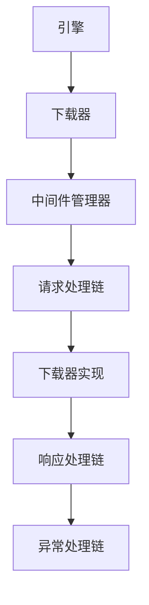

# 中间件管理器

中间件管理器是Crawlo框架中管理中间件处理的核心组件。它在请求/响应生命周期中协调中间件组件的执行。

## 概述

中间件管理器负责：

- 加载和初始化中间件组件
- 按正确顺序执行中间件链
- 处理中间件响应和异常
- 与下载器和引擎组件集成

## 架构

中间件管理器编排中间件执行：



## 主要特性

### 中间件链管理

中间件管理器为不同的处理阶段维护单独的链：

- **请求处理链**：在请求发送前执行
- **响应处理链**：在响应接收后执行
- **异常处理链**：在异常发生时执行

### 动态中间件加载

中间件组件根据配置动态加载：

```python
# 在settings.py中
MIDDLEWARES = [
    'crawlo.middleware.request_ignore.RequestIgnoreMiddleware',
    'crawlo.middleware.download_delay.DownloadDelayMiddleware',
    # ... 更多中间件
]
```

### 异步处理

所有中间件处理都是异步执行以保持性能：

- 非阻塞中间件执行
- 尽可能并发处理
- 适当的异常处理和传播

## API参考

### `MiddlewareManager(crawler)`

创建一个新的中间件管理器实例。

**参数：**
- `crawler`：拥有此管理器的爬虫实例

### `async download(request)`

通过中间件链处理请求并下载。

**参数：**
- `request`：要处理和下载的请求

**返回：**
- `Response`：下载的响应

### `create_instance(*args, **kwargs)`

创建中间件管理器实例的类方法。

## 中间件处理流程

### 请求处理

1. 按顺序调用每个中间件的[process_request](https://github.com/crawl-coder/Crawlo/blob/master/crawlo/middleware/base.py#L22)方法
2. 如果中间件返回响应，则处理短路
3. 如果中间件返回请求，则替换原始请求
4. 如果所有中间件都返回None，则请求发送到下载器

### 响应处理

1. 按相反顺序调用每个中间件的[process_response](https://github.com/crawl-coder/Crawlo/blob/master/crawlo/middleware/base.py#L28)方法
2. 如果中间件返回请求，则安排重新下载
3. 如果中间件返回响应，则替换当前响应
4. 最终响应返回给引擎

### 异常处理

1. 当异常发生时，调用中间件的[process_exception](https://github.com/crawl-coder/Crawlo/blob/master/crawlo/middleware/base.py#L35)方法
2. 如果中间件返回响应，则用作结果
3. 如果中间件返回请求，则安排重新下载
4. 如果没有中间件处理异常，则重新抛出

## 配置

中间件管理器使用[MIDDLEWARES](https://github.com/crawl-coder/Crawlo/blob/master/examples/api_data_collection/api_data_collection/settings.py#L24)设置来确定要加载的中间件：

```python
MIDDLEWARES = [
    # 请求处理中间件
    'crawlo.middleware.request_ignore.RequestIgnoreMiddleware',
    'crawlo.middleware.download_delay.DownloadDelayMiddleware',
    'crawlo.middleware.default_header.DefaultHeaderMiddleware',
    
    # 响应处理中间件
    'crawlo.middleware.retry.RetryMiddleware',
    'crawlo.middleware.response_code.ResponseCodeMiddleware',
    
    # 异常处理中间件
    'crawlo.middleware.proxy.ProxyMiddleware',
]
```

## 使用示例

```python
from crawlo.middleware.middleware_manager import MiddlewareManager

# 中间件管理器通常由下载器自动创建，但也可以手动创建：

manager = MiddlewareManager(crawler)

# 处理并下载请求
response = await manager.download(request)
```

## 性能考虑

- 中间件顺序影响性能 - 将轻量级中间件放在前面
- 最小化中间件方法中的阻塞操作
- 为中间件状态使用高效的数据结构
- 监控中间件处理时间以识别瓶颈