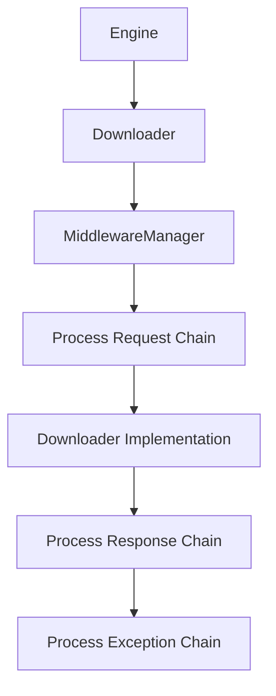

# MiddlewareManager

The MiddlewareManager is the core component that manages middleware processing in the Crawlo framework. It coordinates the execution of middleware components during the request/response lifecycle.

## Overview

The MiddlewareManager is responsible for:

- Loading and initializing middleware components
- Executing middleware chains in the correct order
- Handling middleware responses and exceptions
- Integrating with the downloader and engine components

## Architecture

The MiddlewareManager orchestrates middleware execution:



## Key Features

### Middleware Chain Management

The MiddlewareManager maintains separate chains for different processing phases:

- **Request Processing Chain**: Executes before requests are sent
- **Response Processing Chain**: Executes after responses are received
- **Exception Processing Chain**: Executes when exceptions occur

### Dynamic Middleware Loading

Middleware components are loaded dynamically based on configuration:

```python
# In settings.py
MIDDLEWARES = [
    'crawlo.middleware.request_ignore.RequestIgnoreMiddleware',
    'crawlo.middleware.download_delay.DownloadDelayMiddleware',
    # ... more middleware
]
```

### Asynchronous Processing

All middleware processing is performed asynchronously to maintain performance:

- Non-blocking middleware execution
- Concurrent processing when possible
- Proper exception handling and propagation

## API Reference

### `MiddlewareManager(crawler)`

Creates a new MiddlewareManager instance.

**Parameters:**
- `crawler`: The crawler instance that owns this manager

### `async download(request)`

Processes a request through the middleware chain and downloads it.

**Parameters:**
- `request`: The request to process and download

**Returns:**
- `Response`: The downloaded response

### `create_instance(*args, **kwargs)`

Class method to create a MiddlewareManager instance.

## Middleware Processing Flow

### Request Processing

1. Each middleware's `process_request` method is called in order
2. If a middleware returns a Response, processing short-circuits
3. If a middleware returns a Request, it replaces the original request
4. If all middleware return None, the request is sent to the downloader

### Response Processing

1. Each middleware's `process_response` method is called in reverse order
2. If a middleware returns a Request, it's scheduled for redownload
3. If a middleware returns a Response, it replaces the current response
4. The final response is returned to the engine

### Exception Processing

1. When an exception occurs, middleware `process_exception` methods are called
2. If a middleware returns a Response, it's used as the result
3. If a middleware returns a Request, it's scheduled for redownload
4. If no middleware handles the exception, it's re-raised

## Configuration

The MiddlewareManager uses the `MIDDLEWARES` setting to determine which middleware to load:

```python
MIDDLEWARES = [
    # Request processing middleware
    'crawlo.middleware.request_ignore.RequestIgnoreMiddleware',
    'crawlo.middleware.download_delay.DownloadDelayMiddleware',
    'crawlo.middleware.default_header.DefaultHeaderMiddleware',
    
    # Response processing middleware
    'crawlo.middleware.retry.RetryMiddleware',
    'crawlo.middleware.response_code.ResponseCodeMiddleware',
    
    # Exception processing middleware
    'crawlo.middleware.proxy.ProxyMiddleware',
]
```

## Example Usage

```python
from crawlo.middleware.middleware_manager import MiddlewareManager

# The MiddlewareManager is typically created automatically
# by the downloader, but can be created manually:

manager = MiddlewareManager(crawler)

# Process and download a request
response = await manager.download(request)
```

## Performance Considerations

- Middleware order affects performance - place lightweight middleware first
- Minimize blocking operations in middleware methods
- Use efficient data structures for middleware state
- Monitor middleware processing times to identify bottlenecks