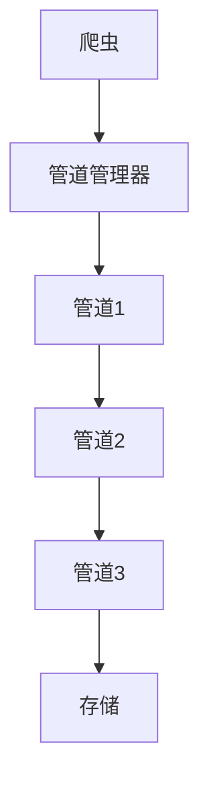

# 管道模块

管道模块提供了一个灵活的系统，用于处理由爬虫提取的数据项。管道组件可以清理、验证、转换和存储数据项。

## 目录
- [PipelineManager](manager.md) - 核心管道管理系统
- [内置管道](built_in.md) - 内置管道组件概述

## 概述

管道组件负责处理爬虫提取的数据项。它们提供了一个顺序处理链，每个管道组件可以：

1. **处理数据项**：转换、清理或验证数据项
2. **存储数据**：将数据项保存到数据库、文件或其他存储系统
3. **过滤数据项**：丢弃不符合特定条件的数据项
4. **去重数据项**：防止重复数据项被处理

## 架构



## 主要特性

- **顺序处理**：数据项按定义的顺序流经管道
- **灵活配置**：通过设置启用/禁用管道
- **数据验证**：验证和清理提取的数据
- **多种存储选项**：将数据保存到各种存储系统
- **去重**：内置支持数据项去重

## 内置管道

Crawlo提供了几个内置管道组件：

| 管道 | 用途 |
|------|------|
| `ConsolePipeline` | 将数据项输出到控制台 |
| `JsonPipeline` | 将数据项保存到JSON文件 |
| `CsvPipeline` | 将数据项保存到CSV文件 |
| `AsyncmyMySQLPipeline` | 将数据项存储到MySQL数据库 |
| `MongoPipeline` | 将数据项存储到MongoDB |
| `MemoryDedupPipeline` | 在内存中对数据项去重 |
| `RedisDedupPipeline` | 使用Redis对数据项去重 |
| `BloomDedupPipeline` | 使用布隆过滤器对数据项去重 |

## 配置

管道组件在项目的[settings.py](https://github.com/crawl-coder/Crawlo/blob/master/examples/api_data_collection/api_data_collection/settings.py)中配置：

```python
PIPELINES = [
    'crawlo.pipelines.console_pipeline.ConsolePipeline',
    'crawlo.pipelines.json_pipeline.JsonPipeline',
    'crawlo.pipelines.mysql_pipeline.AsyncmyMySQLPipeline',
]
```

## 管道处理流程

1. **数据项处理**：按顺序调用每个管道的[process_item](https://github.com/crawl-coder/Crawlo/blob/master/crawlo/pipelines/base.py#L15)方法
2. **数据项转换**：管道可以修改数据项或返回新的数据项
3. **数据项过滤**：管道可以通过抛出[ItemDiscard](https://github.com/crawl-coder/Crawlo/blob/master/crawlo/exception.py#L35)来丢弃数据项
4. **数据存储**：最终管道通常将数据存储到持久化存储中

## 创建自定义管道

要创建自定义管道，请实现[process_item](https://github.com/crawl-coder/Crawlo/blob/master/crawlo/pipelines/base.py#L15)方法：

```python
class CustomPipeline:
    def process_item(self, item, spider):
        # 处理数据项
        return item  # 返回处理后的数据项
```

有关管道管理器和特定管道实现的详细信息，请参阅单独的文档页面。