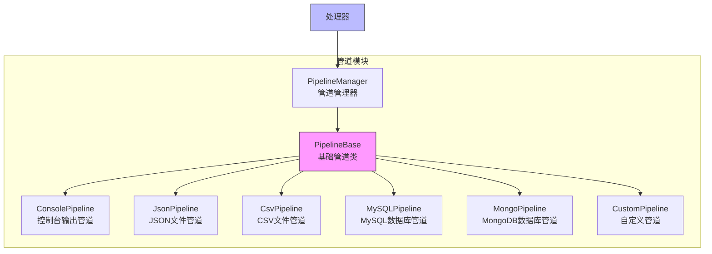

# 管道模块

管道模块是 Crawlo 框架中负责处理和存储爬取数据的组件。它提供了一个数据处理流水线，允许用户对爬取的数据进行清洗、验证和存储等操作。

## 模块概述

管道模块采用流水线设计，支持多种管道实现。用户可以通过配置管道列表来定义数据处理流程，实现数据的清洗、验证、转换和存储等功能。

### 核心组件

1. [PipelineManager](manager.md) - 管道管理器
2. [内置管道](built_in.md) - 框架提供的内置管道
3. [自定义管道](custom.md) - 用户自定义的管道

## 架构设计



## 管道类型

### ConsolePipeline

**功能:**
- 将数据项输出到控制台
- 适用于调试和开发阶段

**配置选项:**
```python
# 控制台管道无需特殊配置
PIPELINES = [
    'crawlo.pipelines.ConsolePipeline',
]
```

### JsonPipeline

**功能:**
- 将数据项保存为 JSON 格式文件
- 支持数据持久化存储

**配置选项:**
```python
# 设置 JSON 文件路径
JSON_PIPELINE_FILE = 'output.json'

# 设置是否追加模式
JSON_PIPELINE_APPEND = True
```

### CsvPipeline

**功能:**
- 将数据项保存为 CSV 格式文件
- 适用于表格数据存储

**配置选项:**
```python
# 设置 CSV 文件路径
CSV_PIPELINE_FILE = 'output.csv'

# 设置 CSV 字段分隔符
CSV_PIPELINE_DELIMITER = ','
```

### MySQLPipeline

**功能:**
- 将数据项存储到 MySQL 数据库
- 支持数据持久化和查询

**配置选项:**
```python
# MySQL 数据库配置
MYSQL_HOST = '127.0.0.1'
MYSQL_PORT = 3306
MYSQL_USER = 'root'
MYSQL_PASSWORD = 'password'
MYSQL_DATABASE = 'crawlo'
```

### MongoPipeline

**功能:**
- 将数据项存储到 MongoDB 数据库
- 支持非结构化数据存储

**配置选项:**
```python
# MongoDB 配置
MONGO_URI = 'mongodb://127.0.0.1:27017'
MONGO_DATABASE = 'crawlo'
```

## 配置选项

管道模块的行为可以通过以下配置项进行调整：

| 配置项 | 类型 | 默认值 | 说明 |
|--------|------|--------|------|
| PIPELINES | list | [] | 管道列表 |
| JSON_PIPELINE_FILE | str | 'output.json' | JSON 管道文件路径 |
| JSON_PIPELINE_APPEND | bool | True | JSON 管道是否追加模式 |
| CSV_PIPELINE_FILE | str | 'output.csv' | CSV 管道文件路径 |
| CSV_PIPELINE_DELIMITER | str | ',' | CSV 管道字段分隔符 |
| MYSQL_HOST | str | '127.0.0.1' | MySQL 主机地址 |
| MYSQL_PORT | int | 3306 | MySQL 端口 |
| MYSQL_USER | str | 'root' | MySQL 用户名 |
| MYSQL_PASSWORD | str | '' | MySQL 密码 |
| MYSQL_DATABASE | str | 'crawlo' | MySQL 数据库名 |
| MONGO_URI | str | 'mongodb://127.0.0.1:27017' | MongoDB 连接 URI |
| MONGO_DATABASE | str | 'crawlo' | MongoDB 数据库名 |

## 使用示例

### 配置管道

```python
# 在配置文件中配置管道
PIPELINES = [
    'crawlo.pipelines.ConsolePipeline',
    'crawlo.pipelines.JsonPipeline',
    'crawlo.pipelines.MySQLPipeline',
]

# 配置管道参数
JSON_PIPELINE_FILE = 'products.json'
MYSQL_HOST = '127.0.0.1'
MYSQL_DATABASE = 'product_db'
```

### 创建自定义管道

```python
from crawlo.pipelines import PipelineBase

class CustomPipeline(PipelineBase):
    def open_spider(self, spider):
        """爬虫启动时调用"""
        # 初始化资源
        self.file = open('custom_output.txt', 'w')
    
    def close_spider(self, spider):
        """爬虫关闭时调用"""
        # 释放资源
        self.file.close()
    
    def process_item(self, item, spider):
        """处理数据项"""
        # 数据处理逻辑
        processed_item = self.clean_data(item)
        
        # 保存数据
        self.file.write(f"{processed_item}\n")
        
        # 返回处理后的数据项（可以是原数据项或新数据项）
        return processed_item
    
    def clean_data(self, item):
        """数据清洗"""
        # 实现数据清洗逻辑
        item['name'] = item['name'].strip()
        item['price'] = float(item['price'])
        return item
```

## 执行顺序

管道按照配置列表中的顺序执行：

1. **数据项处理** - 依次执行每个管道的 [process_item](../../api/crawlo_pipelines.md#process_item) 方法
2. **返回值处理** - 每个管道可以返回原数据项、新数据项或 None
3. **流水线传递** - 如果返回数据项，则传递给下一个管道；如果返回 None，则丢弃该数据项

## 性能优化

### 管道选择

```python
# 只配置需要的管道
PIPELINES = [
    'crawlo.pipelines.JsonPipeline',      # 只有需要 JSON 输出时才配置
    'crawlo.pipelines.MySQLPipeline',     # 只有需要存储到 MySQL 时才配置
]
```

### 批量处理

```python
class BatchPipeline(PipelineBase):
    def __init__(self, settings):
        super().__init__(settings)
        self.batch_size = 100
        self.buffer = []
    
    def process_item(self, item, spider):
        """批量处理数据项"""
        self.buffer.append(item)
        
        if len(self.buffer) >= self.batch_size:
            self.flush_buffer()
        
        return item
    
    def flush_buffer(self):
        """刷新缓冲区"""
        # 批量写入数据库或文件
        self.batch_write(self.buffer)
        self.buffer.clear()
    
    def close_spider(self, spider):
        """关闭爬虫时刷新剩余数据"""
        if self.buffer:
            self.flush_buffer()
```

## 错误处理

### 管道异常处理

```python
def process_item(self, item, spider):
    try:
        # 处理逻辑
        return item
    except Exception as e:
        self.logger.error(f"管道处理失败: {e}")
        # 可以选择丢弃数据项或重新处理
        return item  # 继续传递给下一个管道
```

## 监控和日志

管道模块集成了详细的监控和日志功能：

```python
# 记录管道操作日志
logger.info(f"管道处理数据项: {item}")
logger.debug(f"管道处理结果: {processed_item}")

# 记录异常日志
logger.error(f"管道执行失败: {e}")
```

## 最佳实践

### 合理配置管道

```python
# 开发阶段配置
PIPELINES = [
    'crawlo.pipelines.ConsolePipeline',   # 控制台输出便于调试
    'crawlo.pipelines.JsonPipeline',      # JSON 文件备份
]

# 生产环境配置
PIPELINES = [
    'crawlo.pipelines.MySQLPipeline',     # 存储到数据库
    'crawlo.pipelines.JsonPipeline',      # JSON 文件备份
]
```

### 管道性能优化

```python
class EfficientPipeline(PipelineBase):
    def __init__(self, settings):
        super().__init__(settings)
        # 使用连接池
        self.connection_pool = self.create_connection_pool()
        # 缓存常用数据
        self.cache = {}
    
    def process_item(self, item, spider):
        # 使用连接池和缓存提高性能
        connection = self.connection_pool.get_connection()
        # 处理逻辑
        return item
```

### 数据验证最佳实践

```python
def process_item(self, item, spider):
    """数据验证的最佳实践"""
    # 验证必填字段
    if not item.get('name'):
        self.logger.warning(f"数据项缺少名称字段: {item}")
        return None  # 丢弃无效数据项
    
    # 验证数据格式
    try:
        price = float(item['price'])
        if price < 0:
            self.logger.warning(f"价格不能为负数: {item}")
            return None
    except ValueError:
        self.logger.warning(f"价格格式错误: {item}")
        return None
    
    # 验证通过，继续处理
    return item
```