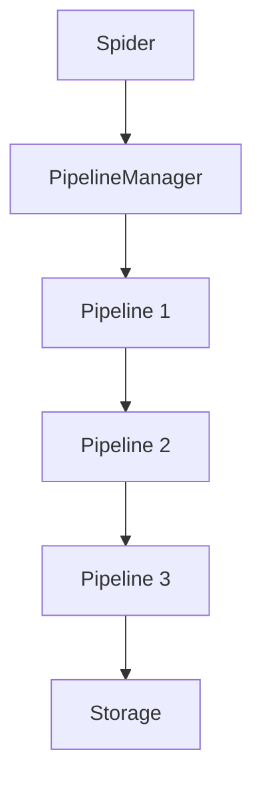

# Pipeline Module

The pipeline module provides a flexible system for processing items extracted by spiders. Pipeline components can clean, validate, transform, and store data items.

## Table of Contents
- [PipelineManager](manager_en.md) - Core pipeline management system
- [Built-in Pipelines](built_in_en.md) - Overview of built-in pipeline components

## Overview

Pipeline components are responsible for processing items after they are extracted by spiders. They provide a sequential processing chain where each pipeline component can:

1. **Process Items**: Transform, clean, or validate data items
2. **Store Data**: Save items to databases, files, or other storage systems
3. **Filter Items**: Drop items that don't meet certain criteria
4. **Deduplicate Items**: Prevent duplicate items from being processed

## Architecture



## Key Features

- **Sequential Processing**: Items flow through pipelines in a defined order
- **Flexible Configuration**: Enable/disable pipelines through settings
- **Data Validation**: Validate and clean extracted data
- **Multiple Storage Options**: Save data to various storage systems
- **Deduplication**: Built-in support for item deduplication

## Built-in Pipelines

Crawlo provides several built-in pipeline components:

| Pipeline | Purpose |
|----------|---------|
| `ConsolePipeline` | Outputs items to the console |
| `JsonPipeline` | Saves items to JSON files |
| `CsvPipeline` | Saves items to CSV files |
| `AsyncmyMySQLPipeline` | Stores items in MySQL database |
| `MongoPipeline` | Stores items in MongoDB |
| `MemoryDedupPipeline` | Deduplicates items in memory |
| `RedisDedupPipeline` | Deduplicates items using Redis |
| `BloomDedupPipeline` | Deduplicates items using Bloom filters |

## Configuration

Pipeline components are configured in your project's `settings.py`:

```python
PIPELINES = [
    'crawlo.pipelines.console_pipeline.ConsolePipeline',
    'crawlo.pipelines.json_pipeline.JsonPipeline',
    'crawlo.pipelines.mysql_pipeline.AsyncmyMySQLPipeline',
]
```

## Pipeline Processing Flow

1. **Item Processing**: Each pipeline's `process_item` method is called in order
2. **Item Transformation**: Pipelines can modify items or return new ones
3. **Item Filtering**: Pipelines can drop items by raising `ItemDiscard`
4. **Data Storage**: Final pipelines typically store data to persistent storage

## Creating Custom Pipelines

To create a custom pipeline, implement the `process_item` method:

```python
class CustomPipeline:
    def process_item(self, item, spider):
        # Process the item
        return item  # Return processed item
```

For detailed information about the pipeline manager and specific pipeline implementations, see the individual documentation pages.