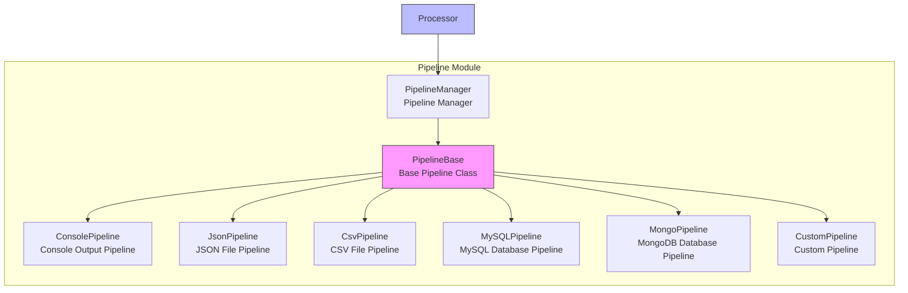

# Pipeline Module

The pipeline module is the component in the Crawlo framework responsible for processing and storing crawled data. It provides a data processing pipeline that allows users to clean, validate, and store crawled data.

## Module Overview

The pipeline module adopts a pipeline design, supporting multiple pipeline implementations. Users can define data processing workflows by configuring a pipeline list to implement data cleaning, validation, transformation, and storage functions.

### Core Components

1. [PipelineManager](manager_en.md) - Pipeline manager
2. [Built-in Pipelines](built_in_en.md) - Built-in pipelines provided by the framework
3. [Custom Pipelines](custom_en.md) - User-defined pipelines

## Architecture Design



## Pipeline Types

### ConsolePipeline

**Function:**
- Output items to the console
- Suitable for debugging and development phases

**Configuration Options:**
```python
# Console pipeline requires no special configuration
PIPELINES = [
    'crawlo.pipelines.ConsolePipeline',
]
```

### JsonPipeline

**Function:**
- Save items as JSON format files
- Supports data persistence storage

**Configuration Options:**
```python
# Set JSON file path
JSON_PIPELINE_FILE = 'output.json'

# Set whether to use append mode
JSON_PIPELINE_APPEND = True
```

### CsvPipeline

**Function:**
- Save items as CSV format files
- Suitable for tabular data storage

**Configuration Options:**
```python
# Set CSV file path
CSV_PIPELINE_FILE = 'output.csv'

# Set CSV field delimiter
CSV_PIPELINE_DELIMITER = ','
```

### MySQLPipeline

**Function:**
- Store items in MySQL database
- Supports data persistence and querying

**Configuration Options:**
```python
# MySQL database configuration
MYSQL_HOST = '127.0.0.1'
MYSQL_PORT = 3306
MYSQL_USER = 'root'
MYSQL_PASSWORD = 'password'
MYSQL_DATABASE = 'crawlo'
```

### MongoPipeline

**Function:**
- Store items in MongoDB database
- Supports unstructured data storage

**Configuration Options:**
```python
# MongoDB configuration
MONGO_URI = 'mongodb://127.0.0.1:27017'
MONGO_DATABASE = 'crawlo'
```

## Configuration Options

The pipeline module's behavior can be adjusted through the following configuration options:

| Configuration Item | Type | Default Value | Description |
|--------------------|------|---------------|-------------|
| PIPELINES | list | [] | Pipeline list |
| JSON_PIPELINE_FILE | str | 'output.json' | JSON pipeline file path |
| JSON_PIPELINE_APPEND | bool | True | Whether JSON pipeline uses append mode |
| CSV_PIPELINE_FILE | str | 'output.csv' | CSV pipeline file path |
| CSV_PIPELINE_DELIMITER | str | ',' | CSV pipeline field delimiter |
| MYSQL_HOST | str | '127.0.0.1' | MySQL host address |
| MYSQL_PORT | int | 3306 | MySQL port |
| MYSQL_USER | str | 'root' | MySQL username |
| MYSQL_PASSWORD | str | '' | MySQL password |
| MYSQL_DATABASE | str | 'crawlo' | MySQL database name |
| MONGO_URI | str | 'mongodb://127.0.0.1:27017' | MongoDB connection URI |
| MONGO_DATABASE | str | 'crawlo' | MongoDB database name |

## Usage Examples

### Configure Pipelines

```python
# Configure pipelines in configuration file
PIPELINES = [
    'crawlo.pipelines.ConsolePipeline',
    'crawlo.pipelines.JsonPipeline',
    'crawlo.pipelines.MySQLPipeline',
]

# Configure pipeline parameters
JSON_PIPELINE_FILE = 'products.json'
MYSQL_HOST = '127.0.0.1'
MYSQL_DATABASE = 'product_db'
```

### Create Custom Pipeline

```python
from crawlo.pipelines import PipelineBase

class CustomPipeline(PipelineBase):
    def open_spider(self, spider):
        """Called when spider starts"""
        # Initialize resources
        self.file = open('custom_output.txt', 'w')
    
    def close_spider(self, spider):
        """Called when spider closes"""
        # Release resources
        self.file.close()
    
    def process_item(self, item, spider):
        """Process item"""
        # Data processing logic
        processed_item = self.clean_data(item)
        
        # Save data
        self.file.write(f"{processed_item}\n")
        
        # Return processed item (can be original item or new item)
        return processed_item
    
    def clean_data(self, item):
        """Data cleaning"""
        # Implement data cleaning logic
        item['name'] = item['name'].strip()
        item['price'] = float(item['price'])
        return item
```

## Execution Order

Pipelines are executed in the order of the configuration list:

1. **Item Processing** - Execute each pipeline's [process_item](../../api/crawlo_pipelines.md) method in sequence
2. **Return Value Processing** - Each pipeline can return the original item, a new item, or None
3. **Pipeline Passing** - If an item is returned, it's passed to the next pipeline; if None is returned, the item is discarded

## Performance Optimization

### Pipeline Selection

```python
# Only configure needed pipelines
PIPELINES = [
    'crawlo.pipelines.JsonPipeline',      # Only configure when JSON output is needed
    'crawlo.pipelines.MySQLPipeline',     # Only configure when storing to MySQL is needed
]
```

### Batch Processing

```python
class BatchPipeline(PipelineBase):
    def __init__(self, settings):
        super().__init__(settings)
        self.batch_size = 100
        self.buffer = []
    
    def process_item(self, item, spider):
        """Batch process items"""
        self.buffer.append(item)
        
        if len(self.buffer) >= self.batch_size:
            self.flush_buffer()
        
        return item
    
    def flush_buffer(self):
        """Flush buffer"""
        # Batch write to database or file
        self.batch_write(self.buffer)
        self.buffer.clear()
    
    def close_spider(self, spider):
        """Flush remaining data when spider closes"""
        if self.buffer:
            self.flush_buffer()
```

## Error Handling

### Pipeline Exception Handling

```python
def process_item(self, item, spider):
    try:
        # Processing logic
        return item
    except Exception as e:
        self.logger.error(f"Pipeline processing failed: {e}")
        # Can choose to discard item or reprocess
        return item  # Continue passing to next pipeline
```

## Monitoring and Logging

The pipeline module integrates detailed monitoring and logging functionality:

```python
# Log pipeline operations
logger.info(f"Pipeline processing item: {item}")
logger.debug(f"Pipeline processing result: {processed_item}")

# Log exception information
logger.error(f"Pipeline execution failed: {e}")
```

## Best Practices

### Reasonable Pipeline Configuration

```python
# Development phase configuration
PIPELINES = [
    'crawlo.pipelines.ConsolePipeline',   # Console output for debugging
    'crawlo.pipelines.JsonPipeline',      # JSON file backup
]

# Production environment configuration
PIPELINES = [
    'crawlo.pipelines.MySQLPipeline',     # Store to database
    'crawlo.pipelines.JsonPipeline',      # JSON file backup
]
```

### Pipeline Performance Optimization

```python
class EfficientPipeline(PipelineBase):
    def __init__(self, settings):
        super().__init__(settings)
        # Use connection pool
        self.connection_pool = self.create_connection_pool()
        # Cache common data
        self.cache = {}
    
    def process_item(self, item, spider):
        # Use connection pool and cache to improve performance
        connection = self.connection_pool.get_connection()
        # Processing logic
        return item
```

### Data Validation Best Practices

```python
def process_item(self, item, spider):
    """Best practices for data validation"""
    # Validate required fields
    if not item.get('name'):
        self.logger.warning(f"Item missing name field: {item}")
        return None  # Discard invalid item
    
    # Validate data format
    try:
        price = float(item['price'])
        if price < 0:
            self.logger.warning(f"Price cannot be negative: {item}")
            return None
    except ValueError:
        self.logger.warning(f"Price format error: {item}")
        return None
    
    # Validation passed, continue processing
    return item
```