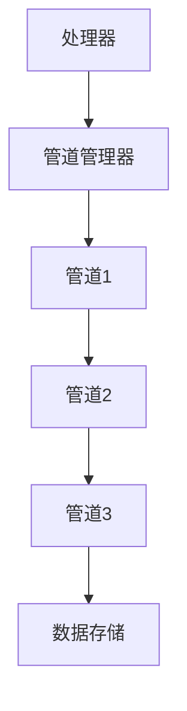

# 管道管理器

管道管理器是Crawlo框架中管理管道处理的核心组件。它在数据项处理生命周期中协调管道组件的执行。

## 概述

管道管理器负责：

- 加载和初始化管道组件
- 按正确顺序执行管道链
- 处理数据项处理和转换
- 与处理器和引擎组件集成

## 架构

管道管理器编排管道执行：



## 主要特性

### 管道链管理

管道管理器维护管道组件的顺序链：

- 数据项按配置的顺序流经管道
- 每个管道可以转换、过滤或处理数据项
- 管道可以通过抛出ItemDiscard异常来丢弃数据项

### 动态管道加载

管道组件根据配置动态加载：

```python
# 在settings.py中
PIPELINES = [
    'crawlo.pipelines.console_pipeline.ConsolePipeline',
    'crawlo.pipelines.json_pipeline.JsonPipeline',
    # ... 更多管道
]
```

### 异步处理

所有管道处理都是异步执行以保持性能：

- 非阻塞管道执行
- 尽可能并发处理
- 适当的异常处理和传播

## API参考

### `PipelineManager(crawler)`

创建一个新的管道管理器实例。

**参数：**
- `crawler`：拥有此管理器的爬虫实例

### `async process_item(item)`

通过管道链处理数据项。

**参数：**
- `item`：要处理的数据项

### `from_crawler(*args, **kwargs)`

创建管道管理器实例的类方法。

## 管道处理流程

1. 数据项传递给链中的第一个管道
2. 按顺序调用每个管道的[process_item](https://github.com/crawl-coder/Crawlo/blob/master/crawlo/pipelines/base.py#L15)方法
3. 管道可以：
   - 返回数据项（可能已修改）以继续处理
   - 抛出ItemDiscard以丢弃数据项
   - 返回新数据项以替换当前数据项
4. 完成管道链的数据项被视为已成功处理

## 配置

管道管理器使用[PIPELINES](https://github.com/crawl-coder/Crawlo/blob/master/examples/api_data_collection/api_data_collection/settings.py#L33)设置来确定要加载的管道：

```python
PIPELINES = [
    # 去重管道（通常在最前面）
    'crawlo.pipelines.memory_dedup_pipeline.MemoryDedupPipeline',
    
    # 处理管道
    'crawlo.pipelines.console_pipeline.ConsolePipeline',
    'crawlo.pipelines.json_pipeline.JsonPipeline',
    
    # 存储管道（通常在最后）
    'crawlo.pipelines.mysql_pipeline.AsyncmyMySQLPipeline',
]
```

## 使用示例

```python
from crawlo.pipelines.pipeline_manager import PipelineManager

# 管道管理器通常由处理器自动创建，但也可以手动创建：

manager = PipelineManager.from_crawler(crawler)

# 处理数据项
await manager.process_item(item)
```

## 错误处理

管道管理器处理各种错误情况：

- **ItemDiscard**：当管道决定丢弃数据项时
- **处理错误**：当管道遇到错误时
- **验证错误**：当数据项验证失败时

## 性能考虑

- 管道顺序影响性能 - 将轻量级管道放在前面
- 最小化管道方法中的阻塞操作
- 为管道状态使用高效的数据结构
- 监控管道处理时间以识别瓶颈
- 考虑为存储管道使用批处理