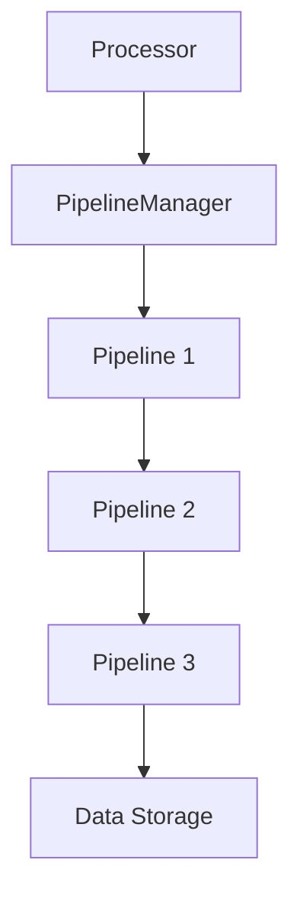

# PipelineManager

The PipelineManager is the core component that manages pipeline processing in the Crawlo framework. It coordinates the execution of pipeline components during the item processing lifecycle.

## Overview

The PipelineManager is responsible for:

- Loading and initializing pipeline components
- Executing pipeline chains in the correct order
- Handling item processing and transformation
- Integrating with the processor and engine components

## Architecture

The PipelineManager orchestrates pipeline execution:



## Key Features

### Pipeline Chain Management

The PipelineManager maintains a sequential chain of pipeline components:

- Items flow through pipelines in the configured order
- Each pipeline can transform, filter, or process items
- Pipelines can drop items by raising ItemDiscard exceptions

### Dynamic Pipeline Loading

Pipeline components are loaded dynamically based on configuration:

```python
# In settings.py
PIPELINES = [
    'crawlo.pipelines.console_pipeline.ConsolePipeline',
    'crawlo.pipelines.json_pipeline.JsonPipeline',
    # ... more pipelines
]
```

### Asynchronous Processing

All pipeline processing is performed asynchronously to maintain performance:

- Non-blocking pipeline execution
- Concurrent processing when possible
- Proper exception handling and propagation

## API Reference

### `PipelineManager(crawler)`

Creates a new PipelineManager instance.

**Parameters:**
- `crawler`: The crawler instance that owns this manager

### `async process_item(item)`

Processes an item through the pipeline chain.

**Parameters:**
- `item`: The item to process

### `from_crawler(*args, **kwargs)`

Class method to create a PipelineManager instance.

## Pipeline Processing Flow

1. Items are passed to the first pipeline in the chain
2. Each pipeline's `process_item` method is called in order
3. Pipelines can:
   - Return the item (possibly modified) to continue processing
   - Raise ItemDiscard to drop the item
   - Return a new item to replace the current one
4. Items that complete the pipeline chain are considered successfully processed

## Configuration

The PipelineManager uses the `PIPELINES` setting to determine which pipelines to load:

```python
PIPELINES = [
    # Deduplication pipelines (typically first)
    'crawlo.pipelines.memory_dedup_pipeline.MemoryDedupPipeline',
    
    # Processing pipelines
    'crawlo.pipelines.console_pipeline.ConsolePipeline',
    'crawlo.pipelines.json_pipeline.JsonPipeline',
    
    # Storage pipelines (typically last)
    'crawlo.pipelines.mysql_pipeline.AsyncmyMySQLPipeline',
]
```

## Example Usage

```python
from crawlo.pipelines.pipeline_manager import PipelineManager

# The PipelineManager is typically created automatically
# by the processor, but can be created manually:

manager = PipelineManager.from_crawler(crawler)

# Process an item
await manager.process_item(item)
```

## Error Handling

The PipelineManager handles various error conditions:

- **ItemDiscard**: When a pipeline decides to drop an item
- **Processing Errors**: When a pipeline encounters an error
- **Validation Errors**: When items fail validation

## Performance Considerations

- Pipeline order affects performance - place lightweight pipelines first
- Minimize blocking operations in pipeline methods
- Use efficient data structures for pipeline state
- Monitor pipeline processing times to identify bottlenecks
- Consider batch processing for storage pipelines