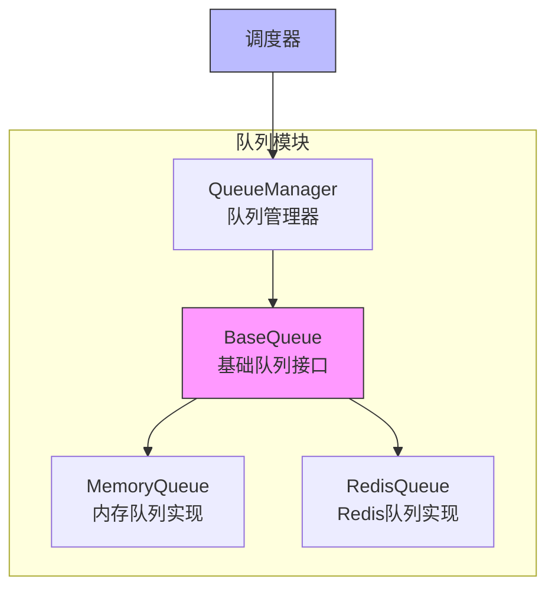

# 队列模块

队列模块是 Crawlo 框架中负责管理请求队列的核心组件。它提供了统一的队列接口，支持内存队列和 Redis 队列，是实现分布式爬取的关键模块。

## 模块概述

队列模块采用抽象设计，通过队列管理器提供统一的接口来操作不同类型的队列。这种设计使得 Crawlo 能够在单机模式和分布式模式之间无缝切换。

### 核心组件

1. [QueueManager](manager.md) - 统一队列管理器
2. [MemoryQueue](memory.md) - 内存队列实现
3. [RedisQueue](redis.md) - Redis 队列实现

## 架构设计



## 队列类型

### 内存队列 (MemoryQueue)

**适用场景:**
- 单机模式下的简单爬取任务
- 开发和测试环境
- 不需要持久化队列数据的场景

**特点:**
- 基于内存存储，访问速度快
- 实现简单，资源消耗低
- 不支持持久化，进程重启后数据丢失

### Redis 队列 (RedisQueue)

**适用场景:**
- 分布式模式下的大规模爬取任务
- 需要队列数据持久化的场景
- 多节点协同工作的环境

**特点:**
- 基于 Redis 存储，支持持久化
- 支持分布式部署
- 支持优先级队列

## 队列管理器

[QueueManager](manager.md) 是队列模块的核心，负责根据配置创建和管理相应的队列实例。

### 主要功能

1. **队列创建** - 根据配置创建合适的队列实例
2. **队列代理** - 代理所有队列操作到实际的队列实例
3. **配置管理** - 管理队列相关的配置参数

### 使用示例

```python
from crawlo.queue import QueueManager
from crawlo.config import CrawloConfig

# 创建配置
config = CrawloConfig.standalone(queue_type='memory')

# 创建队列管理器
queue_manager = QueueManager(config)

# 获取队列实例
queue = queue_manager.get_queue()

# 使用队列
queue.enqueue_request(request)
request = queue.next_request()
```

## 配置选项

队列模块的行为可以通过以下配置项进行调整：

| 配置项 | 类型 | 默认值 | 说明 |
|--------|------|--------|------|
| QUEUE_TYPE | str | 'memory' | 队列类型（memory/redis） |
| SCHEDULER_MAX_QUEUE_SIZE | int | 10000 | 调度器最大队列大小 |
| REDIS_HOST | str | '127.0.0.1' | Redis 主机地址 |
| REDIS_PORT | int | 6379 | Redis 端口 |
| REDIS_PASSWORD | str | None | Redis 密码 |
| REDIS_DB | int | 0 | Redis 数据库编号 |
| QUEUE_PERSISTENCE | bool | True | 是否启用队列持久化 |

## 性能优化

### 内存队列优化

```python
# 限制队列大小防止内存溢出
SCHEDULER_MAX_QUEUE_SIZE = 50000

# 使用高效的内存数据结构
# 内部使用 collections.deque 实现队列
```

### Redis 队列优化

```python
# 配置连接池
REDIS_CONNECTION_POOL_SIZE = 20

# 使用管道批量操作
# 内部使用 Redis pipeline 提高性能
```

## 错误处理

### 连接异常处理

```python
try:
    queue.enqueue_request(request)
except QueueConnectionException:
    logger.error("队列连接失败")
    # 可以选择重试或使用备用队列
```

### 队列满异常处理

```python
try:
    queue.enqueue_request(request)
except QueueFullException:
    logger.warning("队列已满，等待处理")
    # 可以选择等待或丢弃请求
```

## 监控和日志

队列模块集成了详细的监控和日志功能：

```python
# 记录队列操作日志
logger.info(f"请求入队: {request.url}")
logger.debug(f"当前队列大小: {queue.size()}")

# 记录异常日志
logger.error(f"队列操作失败: {e}")
```

## 最佳实践

### 根据模式选择队列类型

```python
# 单机模式使用内存队列
config = CrawloConfig.standalone(queue_type='memory')

# 分布式模式使用 Redis 队列
config = CrawloConfig.distributed(queue_type='redis')
```

### 合理配置队列大小

```python
# 小规模爬取任务
SCHEDULER_MAX_QUEUE_SIZE = 1000

# 大规模爬取任务
SCHEDULER_MAX_QUEUE_SIZE = 100000
```

### 启用队列持久化

```python
# 启用 Redis 队列持久化
QUEUE_PERSISTENCE = True
```