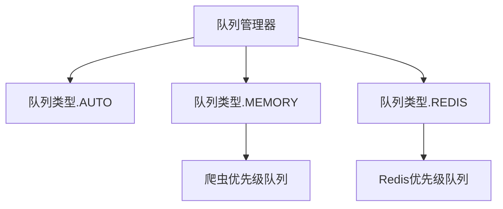

# 队列模块

队列模块为在独立和分布式爬取模式下管理请求队列提供统一接口。它支持多种队列实现，并根据配置自动选择。

## 目录
- [QueueManager](manager.md) - 统一队列管理系统
- [内存队列](memory.md) - 内存队列实现
- [Redis队列](redis.md) - 基于Redis的分布式队列

## 概述

队列模块为管理请求队列提供一致的接口，无论底层实现如何。它支持独立模式的内存队列和分布式爬取的基于Redis的队列。

## 架构



## 主要特性

- **统一接口**：无论队列类型如何都有一致的API
- **自动选择**：根据配置自动选择队列类型
- **背压控制**：防止高负载场景下的队列溢出
- **健康监控**：监控队列状态和性能
- **优雅降级**：如果Redis不可用则回退到内存队列

## 队列类型

### 内存队列

- **使用场景**：独立爬取、开发、测试
- **特性**：快速、轻量、无外部依赖
- **限制**：不适用于分布式爬取

### Redis队列

- **使用场景**：分布式爬取、生产环境
- **特性**：跨多个节点共享、持久化、可扩展
- **要求**：Redis服务器

### 自动选择

- **行为**：如果可用则自动选择Redis，否则回退到内存
- **使用场景**：可在两种模式下工作的灵活部署

## 配置

队列系统可以在项目的[settings.py](https://github.com/crawl-coder/Crawlo/blob/master/examples/api_data_collection/api_data_collection/settings.py)中配置：

```python
# 队列类型选择
QUEUE_TYPE = 'auto'  # 'auto', 'memory', 或 'redis'

# 内存队列设置
SCHEDULER_MAX_QUEUE_SIZE = 2000

# Redis队列设置
REDIS_HOST = '127.0.0.1'
REDIS_PORT = 6379
REDIS_PASSWORD = ''
SCHEDULER_QUEUE_NAME = 'crawlo:myproject:queue:requests'
QUEUE_MAX_RETRIES = 3
QUEUE_TIMEOUT = 300
```

## 使用示例

```python
from crawlo.queue import QueueManager, QueueConfig

# 创建队列配置
config = QueueConfig(
    queue_type='auto',
    redis_url='redis://localhost:6379',
    queue_name='crawlo:myproject:queue:requests'
)

# 初始化队列管理器
queue_manager = QueueManager(config)
await queue_manager.initialize()

# 使用队列
await queue_manager.put(request)
request = await queue_manager.get()
```

有关每个队列实现的详细信息，请参阅单独的文档页面。