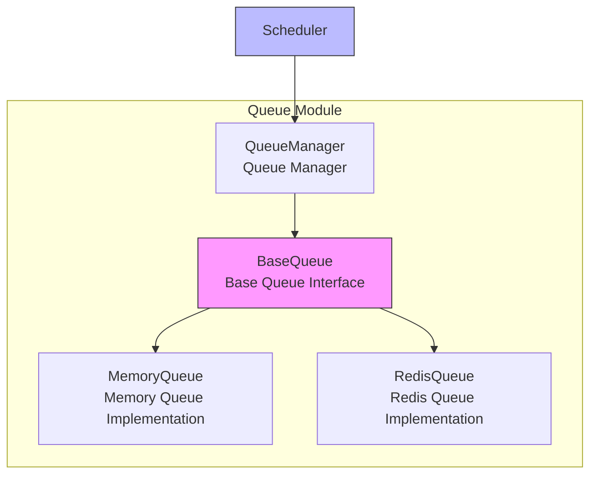

# Queue Module

The queue module is the core component in the Crawlo framework responsible for managing request queues. It provides a unified queue interface, supporting both memory queues and Redis queues, and is a key module for implementing distributed crawling.

## Module Overview

The queue module adopts an abstract design, providing a unified interface to operate different types of queues through the queue manager. This design allows Crawlo to seamlessly switch between standalone and distributed modes.

### Core Components

1. [QueueManager](manager_en.md) - Unified queue manager
2. [MemoryQueue](memory_en.md) - Memory queue implementation
3. [RedisQueue](redis_en.md) - Redis queue implementation

## Architecture Design



## Queue Types

### Memory Queue (MemoryQueue)

**Use Cases:**
- Simple crawling tasks in standalone mode
- Development and testing environments
- Scenarios that don't require queue data persistence

**Features:**
- Memory-based storage, fast access
- Simple implementation, low resource consumption
- No persistence support, data lost on process restart

### Redis Queue (RedisQueue)

**Use Cases:**
- Large-scale crawling tasks in distributed mode
- Scenarios requiring queue data persistence
- Multi-node collaborative environments

**Features:**
- Redis-based storage, supports persistence
- Supports distributed deployment
- Supports priority queues

## Queue Manager

[QueueManager](manager_en.md) is the core of the queue module, responsible for creating and managing queue instances based on configuration.

### Main Functions

1. **Queue Creation** - Create appropriate queue instances based on configuration
2. **Queue Proxy** - Proxy all queue operations to the actual queue instance
3. **Configuration Management** - Manage queue-related configuration parameters

### Usage Example

```python
from crawlo.queue import QueueManager
from crawlo.config import CrawloConfig

# Create configuration
config = CrawloConfig.standalone(queue_type='memory')

# Create queue manager
queue_manager = QueueManager(config)

# Get queue instance
queue = queue_manager.get_queue()

# Use queue
queue.enqueue_request(request)
request = queue.next_request()
```

## Configuration Options

The queue module's behavior can be adjusted through the following configuration options:

| Configuration Item | Type | Default Value | Description |
|--------------------|------|---------------|-------------|
| QUEUE_TYPE | str | 'memory' | Queue type (memory/redis) |
| SCHEDULER_MAX_QUEUE_SIZE | int | 10000 | Maximum scheduler queue size |
| REDIS_HOST | str | '127.0.0.1' | Redis host address |
| REDIS_PORT | int | 6379 | Redis port |
| REDIS_PASSWORD | str | None | Redis password |
| REDIS_DB | int | 0 | Redis database number |
| QUEUE_PERSISTENCE | bool | True | Whether to enable queue persistence |

## Performance Optimization

### Memory Queue Optimization

```python
# Limit queue size to prevent memory overflow
SCHEDULER_MAX_QUEUE_SIZE = 50000

# Use efficient memory data structures
# Internally uses collections.deque to implement queue
```

### Redis Queue Optimization

```python
# Configure connection pool
REDIS_CONNECTION_POOL_SIZE = 20

# Use pipeline for batch operations
# Internally uses Redis pipeline to improve performance
```

## Error Handling

### Connection Exception Handling

```python
try:
    queue.enqueue_request(request)
except QueueConnectionException:
    logger.error("Queue connection failed")
    # Can choose to retry or use backup queue
```

### Queue Full Exception Handling

```python
try:
    queue.enqueue_request(request)
except QueueFullException:
    logger.warning("Queue is full, waiting for processing")
    # Can choose to wait or discard request
```

## Monitoring and Logging

The queue module integrates detailed monitoring and logging functionality:

```python
# Log queue operations
logger.info(f"Request queued: {request.url}")
logger.debug(f"Current queue size: {queue.size()}")

# Log exception information
logger.error(f"Queue operation failed: {e}")
```

## Best Practices

### Choose Queue Type Based on Mode

```python
# Use memory queue for standalone mode
config = CrawloConfig.standalone(queue_type='memory')

# Use Redis queue for distributed mode
config = CrawloConfig.distributed(queue_type='redis')
```

### Configure Queue Size Appropriately

```python
# Small-scale crawling tasks
SCHEDULER_MAX_QUEUE_SIZE = 1000

# Large-scale crawling tasks
SCHEDULER_MAX_QUEUE_SIZE = 100000
```

### Enable Queue Persistence

```python
# Enable Redis queue persistence
QUEUE_PERSISTENCE = True
```