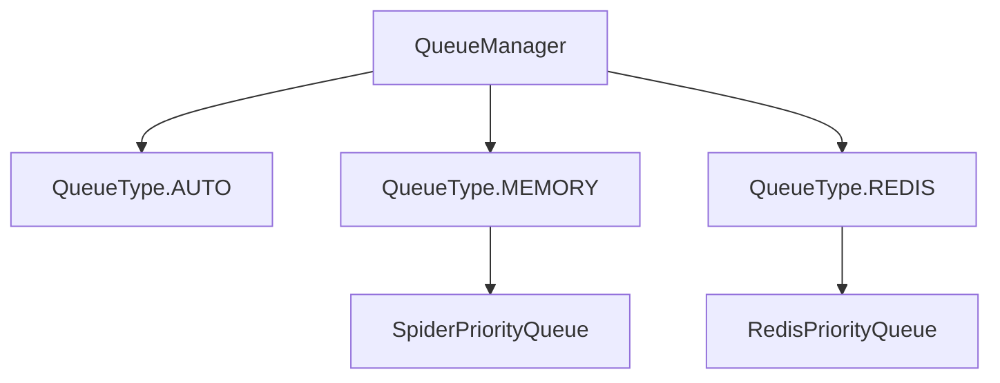

# Queue Module

The queue module provides a unified interface for managing request queues in both standalone and distributed crawling modes. It supports multiple queue implementations with automatic selection based on configuration.

## Table of Contents
- [QueueManager](manager_en.md) - Unified queue management system
- [Memory Queue](memory_en.md) - In-memory queue implementation
- [Redis Queue](redis_en.md) - Distributed Redis-based queue

## Overview

The queue module provides a consistent interface for managing request queues regardless of the underlying implementation. It supports both in-memory queues for standalone mode and Redis-based queues for distributed crawling.

## Architecture



## Key Features

- **Unified Interface**: Consistent API regardless of queue type
- **Automatic Selection**: Automatically choose queue type based on configuration
- **Backpressure Control**: Prevent queue overflow in high-load scenarios
- **Health Monitoring**: Monitor queue status and performance
- **Graceful Degradation**: Fall back to memory queues if Redis is unavailable

## Queue Types

### Memory Queue

- **Use Case**: Standalone crawling, development, testing
- **Features**: Fast, lightweight, no external dependencies
- **Limitations**: Not suitable for distributed crawling

### Redis Queue

- **Use Case**: Distributed crawling, production environments
- **Features**: Shared across multiple nodes, persistent, scalable
- **Requirements**: Redis server

### Auto Selection

- **Behavior**: Automatically selects Redis if available, falls back to memory
- **Use Case**: Flexible deployments that can work in both modes

## Configuration

The queue system can be configured in your project's `settings.py`:

```python
# Queue type selection
QUEUE_TYPE = 'auto'  # 'auto', 'memory', or 'redis'

# Memory queue settings
SCHEDULER_MAX_QUEUE_SIZE = 2000

# Redis queue settings
REDIS_HOST = '127.0.0.1'
REDIS_PORT = 6379
REDIS_PASSWORD = ''
SCHEDULER_QUEUE_NAME = 'crawlo:myproject:queue:requests'
QUEUE_MAX_RETRIES = 3
QUEUE_TIMEOUT = 300
```

## Usage Example

```python
from crawlo.queue import QueueManager, QueueConfig

# Create queue configuration
config = QueueConfig(
    queue_type='auto',
    redis_url='redis://localhost:6379',
    queue_name='crawlo:myproject:queue:requests'
)

# Initialize queue manager
queue_manager = QueueManager(config)
await queue_manager.initialize()

# Use queue
await queue_manager.put(request)
request = await queue_manager.get()
```

For detailed information about each queue implementation, see the individual documentation pages.