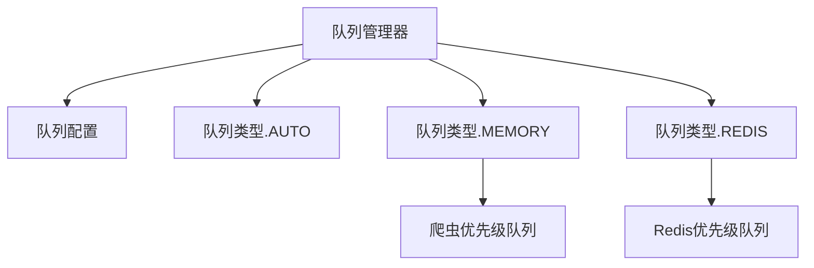

# 队列管理器

队列管理器是Crawlo框架中为管理请求队列提供统一接口的核心组件。它抽象了各种队列实现之间的差异，并提供一致的操作。

## 概述

队列管理器负责：

- 初始化和管理队列实例
- 提供统一的队列操作（put、get、size等）
- 处理不同类型的队列（内存、Redis等）
- 管理队列健康和统计信息

## 架构

队列管理器为不同的队列实现提供统一接口：



## 主要特性

### 统一队列接口

队列管理器提供一致的操作，无论底层实现如何：

- [put(request, priority)](https://github.com/crawl-coder/Crawlo/blob/master/crawlo/queue/base.py#L25)：将请求添加到队列
- [get(timeout)](https://github.com/crawl-coder/Crawlo/blob/master/crawlo/queue/base.py#L34)：从队列检索请求
- [size()](https://github.com/crawl-coder/Crawlo/blob/master/crawlo/queue/base.py#L40)：获取队列大小
- [empty()](https://github.com/crawl-coder/Crawlo/blob/master/crawlo/queue/base.py#L43)：检查队列是否为空
- [close()](https://github.com/crawl-coder/Crawlo/blob/master/crawlo/queue/base.py#L49)：清理资源

### 自动队列选择

队列管理器可以根据配置和可用性自动选择适当的队列类型：

- 如果可用且已配置则使用Redis
- 如果Redis不可用则回退到内存队列
- 在不同环境中提供一致的行为

### 背压控制

队列管理器实现背压机制以防止队列溢出：

- 队列大小限制
- 基于信号量的内存队列流控制
- 队列满时自动暂停

## API参考

### `QueueManager(config)`

创建一个新的队列管理器实例。

**参数：**
- `config`：包含队列设置的QueueConfig实例

### `async initialize()`

初始化队列管理器和底层队列实现。

**返回：**
- `bool`：如果初始化成功则为True

### `async put(request, priority=0)`

将请求添加到队列。

**参数：**
- `request`：要入队的请求
- `priority`：优先级（数字越大优先级越高）

**返回：**
- `bool`：如果请求已入队则为True

### `async get(timeout=5.0)`

从队列检索请求。

**参数：**
- `timeout`：等待请求的最大时间

**返回：**
- `Request`：出队的请求，如果超时则为None

### `async size()`

获取当前队列大小。

**返回：**
- `int`：队列中的请求数量

### `empty()`

检查队列是否为空。

**返回：**
- `bool`：如果队列为空则为True

### `async close()`

清理资源并关闭队列。

### `get_status()`

获取队列状态信息。

**返回：**
- `dict`：状态信息，包括类型、健康和配置

## 配置

队列管理器使用QueueConfig进行配置：

```python
from crawlo.queue.queue_manager import QueueConfig

config = QueueConfig(
    queue_type='auto',  # 'auto', 'memory', 或 'redis'
    redis_url='redis://localhost:6379',
    queue_name='crawlo:requests',
    max_queue_size=2000,
    max_retries=3,
    timeout=300
)

queue_manager = QueueManager(config)
await queue_manager.initialize()
```

## 使用示例

```python
from crawlo.queue.queue_manager import QueueManager, QueueConfig

# 创建配置
config = QueueConfig.from_settings(crawler.settings)

# 创建队列管理器
queue_manager = QueueManager(config)
await queue_manager.initialize()

# 将请求添加到队列
await queue_manager.put(request, priority=5)

# 从队列获取请求
request = await queue_manager.get(timeout=10.0)

# 检查队列大小
size = await queue_manager.size()

# 清理
await queue_manager.close()
```

## 错误处理

队列管理器处理各种错误情况：

- **初始化错误**：队列实现初始化失败
- **连接错误**：Redis连接失败
- **超时错误**：队列操作超时
- **序列化错误**：请求序列化/反序列化失败

## 性能考虑

- 监控队列大小以避免内存问题
- 根据系统资源调整[max_queue_size](https://github.com/crawl-coder/Crawlo/blob/master/crawlo/queue/config.py#L18)
- 为队列操作使用适当的超时值
- 启用统计信息收集以进行性能监控
- 考虑为分布式爬取使用Redis队列

## 队列类型说明

### 内存队列 (Memory Queue)

- 适用于单机开发和测试
- 数据存储在内存中，重启后丢失
- 性能高，无外部依赖
- 不支持分布式部署

### Redis队列 (Redis Queue)

- 适用于生产环境和分布式部署
- 数据持久化存储在Redis中
- 支持多节点共享队列
- 需要Redis服务器

Redis队列使用以下数据结构：
1. **主队列** (`crawlo:{project_name}:queue:requests`)：Redis有序集合，存储待处理请求的指纹和优先级
2. **数据存储** (`crawlo:{project_name}:queue:requests:data`)：Redis哈希表，存储请求指纹到完整序列化请求数据的映射

注意：当前实现已取消处理中队列（processing queue），请求一旦从主队列取出即认为完成处理。