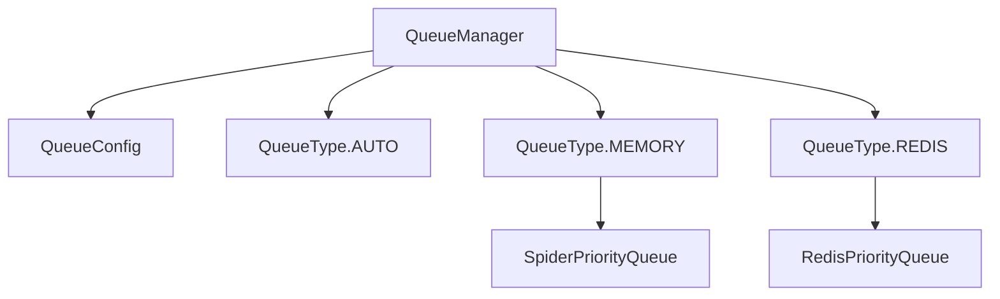

# QueueManager

The QueueManager is the core component that provides a unified interface for managing request queues in the Crawlo framework. It abstracts the differences between various queue implementations and provides consistent operations.

## Overview

The QueueManager is responsible for:

- Initializing and managing queue instances
- Providing unified queue operations (put, get, size, etc.)
- Handling different queue types (memory, Redis, etc.)
- Managing queue health and statistics

## Architecture

The QueueManager provides a unified interface for different queue implementations:



## Key Features

### Unified Queue Interface

The QueueManager provides consistent operations regardless of the underlying implementation:

- `put(request, priority)`: Add request to queue
- `get(timeout)`: Retrieve request from queue
- `size()`: Get queue size
- `empty()`: Check if queue is empty
- `close()`: Clean up resources

### Automatic Queue Selection

The QueueManager can automatically select the appropriate queue type based on configuration and availability:

- Uses Redis if available and configured
- Falls back to memory queues if Redis is unavailable
- Provides consistent behavior across different environments

### Backpressure Control

The QueueManager implements backpressure mechanisms to prevent queue overflow:

- Queue size limits
- Semaphore-based flow control for memory queues
- Automatic pausing when queues are full

## API Reference

### `QueueManager(config)`

Creates a new QueueManager instance.

**Parameters:**
- `config`: QueueConfig instance with queue settings

### `async initialize()`

Initializes the queue manager and underlying queue implementation.

**Returns:**
- `bool`: True if initialization was successful

### `async put(request, priority=0)`

Adds a request to the queue.

**Parameters:**
- `request`: The request to enqueue
- `priority`: Priority level (higher numbers = higher priority)

**Returns:**
- `bool`: True if request was enqueued

### `async get(timeout=5.0)`

Retrieves a request from the queue.

**Parameters:**
- `timeout`: Maximum time to wait for a request

**Returns:**
- `Request`: The dequeued request, or None if timeout

### `async size()`

Gets the current queue size.

**Returns:**
- `int`: Number of requests in the queue

### `empty()`

Checks if the queue is empty.

**Returns:**
- `bool`: True if queue is empty

### `async close()`

Cleans up resources and closes the queue.

### `get_status()`

Gets queue status information.

**Returns:**
- `dict`: Status information including type, health, and config

## Configuration

The QueueManager uses QueueConfig for configuration:

```python
from crawlo.queue.queue_manager import QueueConfig

config = QueueConfig(
    queue_type='auto',  # 'auto', 'memory', or 'redis'
    redis_url='redis://localhost:6379',
    queue_name='crawlo:requests',
    max_queue_size=2000,
    max_retries=3,
    timeout=300
)

queue_manager = QueueManager(config)
await queue_manager.initialize()
```

## Example Usage

```python
from crawlo.queue.queue_manager import QueueManager, QueueConfig

# Create configuration
config = QueueConfig.from_settings(crawler.settings)

# Create queue manager
queue_manager = QueueManager(config)
await queue_manager.initialize()

# Add request to queue
await queue_manager.put(request, priority=5)

# Get request from queue
request = await queue_manager.get(timeout=10.0)

# Check queue size
size = await queue_manager.size()

# Cleanup
await queue_manager.close()
```

## Error Handling

The QueueManager handles various error conditions:

- **Initialization Errors**: Failed to initialize queue implementation
- **Connection Errors**: Redis connection failures
- **Timeout Errors**: Queue operations timing out
- **Serialization Errors**: Failed to serialize/deserialize requests

## Performance Considerations

- Monitor queue sizes to avoid memory issues
- Adjust `max_queue_size` based on system resources
- Use appropriate timeout values for queue operations
- Enable statistics collection for performance monitoring
- Consider using Redis queues for distributed crawling