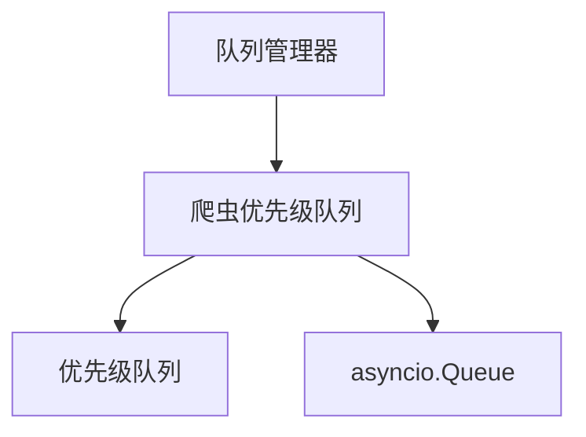

# 内存队列

内存队列是用于独立爬取场景的队列接口的内存实现。它提供快速、轻量级的队列操作，无需外部依赖。

## 概述

内存队列设计用于：

- 独立爬取（单节点）
- 开发和测试环境
- 不需要外部依赖的场景
- 高性能本地爬取

## 架构

内存队列使用Python的内置队列实现：



## 主要特性

### 高性能

- 快速的内存操作
- 最小开销
- 高效的优先级处理
- 低延迟队列操作

### 背压控制

- 可配置的队列大小限制
- 基于信号量的流控制
- 满时自动暂停
- 内存使用监控

### 优先级支持

- 基于优先级的请求排序
- 高效的优先级队列实现
- 可配置的优先级处理

## 实现细节

### 爬虫优先级队列

主要的内存队列实现是[SpiderPriorityQueue](https://github.com/crawl-coder/Crawlo/blob/master/crawlo/queue/pqueue.py#L15)，它提供：

- 优先级队列功能
- 异步/同步操作支持
- 大小限制
- 线程安全操作

### 队列操作

1. **Put**：按优先级将请求添加到队列
2. **Get**：检索最高优先级的请求
3. **Size**：获取当前队列大小
4. **Empty**：检查队列是否为空

## 配置

内存队列通过QueueConfig配置：

```python
# 在settings.py或QueueConfig中
QUEUE_TYPE = 'memory'
SCHEDULER_MAX_QUEUE_SIZE = 2000

# 内存特定设置
REQUEST_GENERATION_BATCH_SIZE = 10
REQUEST_GENERATION_INTERVAL = 0.05
BACKPRESSURE_RATIO = 0.8
```

## API参考

### `SpiderPriorityQueue`

主要的内存队列实现。

#### `put(request)`

将请求添加到队列。

**参数：**
- `request`：要入队的请求

#### `get(timeout=None)`

从队列检索请求。

**参数：**
- `timeout`：等待请求的最大时间

**返回：**
- 出队的请求

#### `qsize()`

获取当前队列大小。

**返回：**
- `int`：队列中的请求数量

#### `empty()`

检查队列是否为空。

**返回：**
- `bool`：如果队列为空则为True

## 使用示例

```python
from crawlo.queue.pqueue import SpiderPriorityQueue

# 创建内存队列
queue = SpiderPriorityQueue()

# 添加请求
await queue.put(request)

# 获取请求
request = await queue.get(timeout=5.0)

# 检查大小
size = queue.qsize()
```

## 性能考虑

### 内存使用

- 队列大小直接影响内存使用
- 大队列可能导致内存压力
- 在操作期间监控队列大小
- 根据可用内存调整[SCHEDULER_MAX_QUEUE_SIZE](https://github.com/crawl-coder/Crawlo/blob/master/crawlo/queue/config.py#L18)

### 并发

- 内存队列适用于中等并发
- 非常高的并发可能需要更复杂的解决方案
- 考虑队列大小和并发之间的权衡

### 限制

- 不适用于分布式爬取
- 重启后无持久性
- 内存受限
- 仅限单节点

## 最佳实践

1. **大小管理**：设置适当的队列大小限制
2. **监控**：监控队列大小和处理速率
3. **背压**：使用背压机制防止溢出
4. **测试**：适用于开发和测试场景
5. **部署**：仅用于独立部署

## 何时使用内存队列

推荐在以下情况下使用内存队列：

- 开发和测试
- 独立爬取场景
- 高性能本地爬取
- 无外部依赖的环境
- 简单的单节点部署

不适用于：

- 分布式爬取
- 对高可靠性有要求的生产环境
- 需要持久性的场景
- 有内存约束的大规模爬取