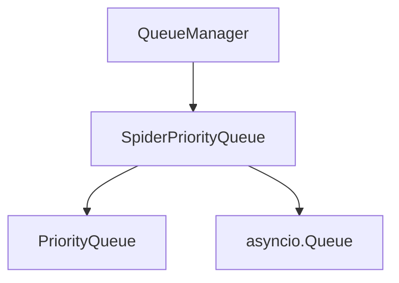

# Memory Queue

The Memory Queue is an in-memory implementation of the queue interface for standalone crawling scenarios. It provides fast, lightweight queue operations without external dependencies.

## Overview

The Memory Queue is designed for:

- Standalone crawling (single node)
- Development and testing environments
- Scenarios where external dependencies are not desired
- High-performance local crawling

## Architecture

The Memory Queue uses Python's built-in queue implementations:



## Key Features

### High Performance

- Fast in-memory operations
- Minimal overhead
- Efficient priority handling
- Low latency queue operations

### Backpressure Control

- Configurable queue size limits
- Semaphore-based flow control
- Automatic pausing when full
- Memory usage monitoring

### Priority Support

- Priority-based request ordering
- Efficient priority queue implementation
- Configurable priority handling

## Implementation Details

### SpiderPriorityQueue

The main memory queue implementation is `SpiderPriorityQueue` which provides:

- Priority queue functionality
- Async/sync operation support
- Size limiting
- Thread-safe operations

### Queue Operations

1. **Put**: Add request to queue with priority
2. **Get**: Retrieve highest priority request
3. **Size**: Get current queue size
4. **Empty**: Check if queue is empty

## Configuration

The Memory Queue is configured through QueueConfig:

```python
# In settings.py or QueueConfig
QUEUE_TYPE = 'memory'
SCHEDULER_MAX_QUEUE_SIZE = 2000

# Memory-specific settings
REQUEST_GENERATION_BATCH_SIZE = 10
REQUEST_GENERATION_INTERVAL = 0.05
BACKPRESSURE_RATIO = 0.8
```

## API Reference

### `SpiderPriorityQueue`

The main memory queue implementation.

#### `put(request)`

Adds a request to the queue.

**Parameters:**
- `request`: The request to enqueue

#### `get(timeout=None)`

Retrieves a request from the queue.

**Parameters:**
- `timeout`: Maximum time to wait for a request

**Returns:**
- The dequeued request

#### `qsize()`

Gets the current queue size.

**Returns:**
- `int`: Number of requests in the queue

#### `empty()`

Checks if the queue is empty.

**Returns:**
- `bool`: True if queue is empty

## Example Usage

```python
from crawlo.queue.pqueue import SpiderPriorityQueue

# Create memory queue
queue = SpiderPriorityQueue()

# Add request
await queue.put(request)

# Get request
request = await queue.get(timeout=5.0)

# Check size
size = queue.qsize()
```

## Performance Considerations

### Memory Usage

- Queue size directly affects memory usage
- Large queues can cause memory pressure
- Monitor queue sizes during operation
- Adjust `SCHEDULER_MAX_QUEUE_SIZE` based on available memory

### Concurrency

- Memory queues are suitable for moderate concurrency
- Very high concurrency may require more sophisticated solutions
- Consider the trade-off between queue size and concurrency

### Limitations

- Not suitable for distributed crawling
- No persistence across restarts
- Memory constrained
- Single node only

## Best Practices

1. **Size Management**: Set appropriate queue size limits
2. **Monitoring**: Monitor queue sizes and processing rates
3. **Backpressure**: Use backpressure mechanisms to prevent overflow
4. **Testing**: Ideal for development and testing scenarios
5. **Deployment**: Use for standalone deployments only

## When to Use Memory Queue

The Memory Queue is recommended for:

- Development and testing
- Standalone crawling scenarios
- High-performance local crawling
- Environments without external dependencies
- Simple, single-node deployments

It is not suitable for:

- Distributed crawling
- Production environments with high reliability requirements
- Scenarios requiring persistence
- Large-scale crawling with memory constraints