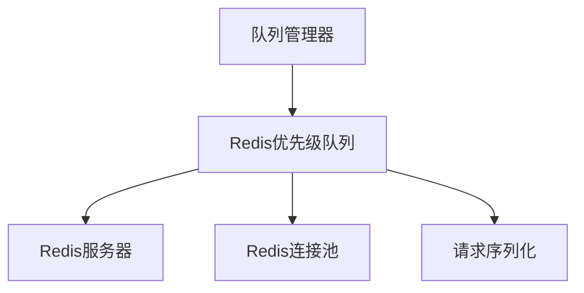

# Redis队列

Redis队列是基于Redis的分布式队列实现，支持多节点爬取场景。它在多个爬虫实例间提供持久化、共享的队列操作。

## 概述

Redis队列设计用于：

- 分布式爬取（多节点）
- 生产环境
- 需要持久化的场景
- 高可用爬取设置

## 架构

Redis队列使用Redis数据结构进行分布式队列操作：



## 主要特性

### 分布式操作

- 跨多个节点的共享队列
- 持久化存储
- 容错性
- 水平扩展

### 优先级支持

- 基于优先级的请求排序
- 高效的优先级队列实现
- 可配置的优先级处理
- 使用Redis有序集合进行优先级管理

### 性能优化

- 连接池
- 管道操作
- 批处理
- 懒连接建立

## 实现细节

### RedisPriorityQueue

主要的Redis队列实现提供：

- 使用Redis有序集合的优先级队列功能
- 请求序列化/反序列化
- 连接管理
- 错误处理和重试

### 队列操作

1. **Put**：按优先级将请求添加到Redis有序集合
2. **Get**：检索最高优先级的请求
3. **Size**：获取当前队列大小
4. **Empty**：检查队列是否为空

### Redis数据结构

Redis队列使用以下数据结构：

1. **主队列** (`crawlo:{project_name}:queue:requests`)：Redis有序集合，存储待处理请求的指纹和优先级
2. **数据存储** (`crawlo:{project_name}:queue:requests:data`)：Redis哈希表，存储请求指纹到完整序列化请求数据的映射

注意：当前实现已取消处理中队列（processing queue），请求一旦从主队列取出即认为完成处理。

## 配置

Redis队列通过QueueConfig配置：

```python
# 在settings.py或QueueConfig中
QUEUE_TYPE = 'redis'
REDIS_HOST = 'localhost'
REDIS_PORT = 6379
REDIS_PASSWORD = ''
REDIS_DB = 0
SCHEDULER_QUEUE_NAME = 'crawlo:myproject:queue:requests'
QUEUE_MAX_RETRIES = 3
QUEUE_TIMEOUT = 300

# Redis特定设置
REDIS_URL = 'redis://localhost:6379/0'
```

## API参考

### `RedisPriorityQueue`

主要的Redis队列实现。

#### `__init__(redis_url, queue_name, max_retries=3, timeout=300)`

创建一个新的RedisPriorityQueue实例。

**参数：**
- `redis_url`：Redis连接URL
- `queue_name`：Redis队列名称
- `max_retries`：最大重试次数
- `timeout`：操作超时时间（秒）

#### `async put(request, priority=0)`

将请求添加到队列。

**参数：**
- `request`：要入队的请求
- `priority`：优先级（数字越大优先级越高）

**返回：**
- `bool`：如果请求已入队则为True

#### `async get(timeout=5.0)`

从队列检索请求。

**参数：**
- `timeout`：等待请求的最大时间

**返回：**
- 出队的请求，如果超时则为None

#### `async qsize()`

获取当前队列大小。

**返回：**
- `int`：队列中的请求数量

#### `async empty()`

检查队列是否为空。

**返回：**
- `bool`：如果队列为空则为True

#### `async close()`

清理资源并关闭连接。

## 使用示例

```python
from crawlo.queue.redis_priority_queue import RedisPriorityQueue

# 创建Redis队列
queue = RedisPriorityQueue(
    redis_url='redis://localhost:6379/0',
    queue_name='crawlo:myproject:queue:requests'
)

# 添加请求
await queue.put(request, priority=5)

# 获取请求
request = await queue.get(timeout=10.0)

# 检查大小
size = await queue.qsize()

# 清理
await queue.close()
```

## 性能考虑

### 连接管理

- 使用连接池以减少开销
- 配置适当的池大小
- 监控连接使用情况
- 优雅地处理连接失败

### 序列化

- 请求序列化会增加开销
- 使用高效的序列化格式
- 最小化请求中的数据大小
- 在可能时缓存序列化数据

### Redis配置

- 优化Redis服务器设置
- 使用适当的Redis数据类型
- 监控Redis内存使用
- 配置Redis持久化设置

## 最佳实践

1. **连接池**：使用连接池以获得更好的性能
2. **错误处理**：实现健壮的错误处理和重试
3. **监控**：监控队列大小和处理速率
4. **序列化**：优化请求序列化
5. **清理**：正确关闭连接并清理资源

## 何时使用Redis队列

推荐在以下情况下使用Redis队列：

- 分布式爬取场景
- 生产环境
- 高可用性要求
- 持久化队列存储
- 多节点部署
- 大规模爬取操作

需要：

- Redis服务器安装和配置
- 到Redis服务器的网络连接
- 适当的Redis安全配置
- Redis实例的监控和维护