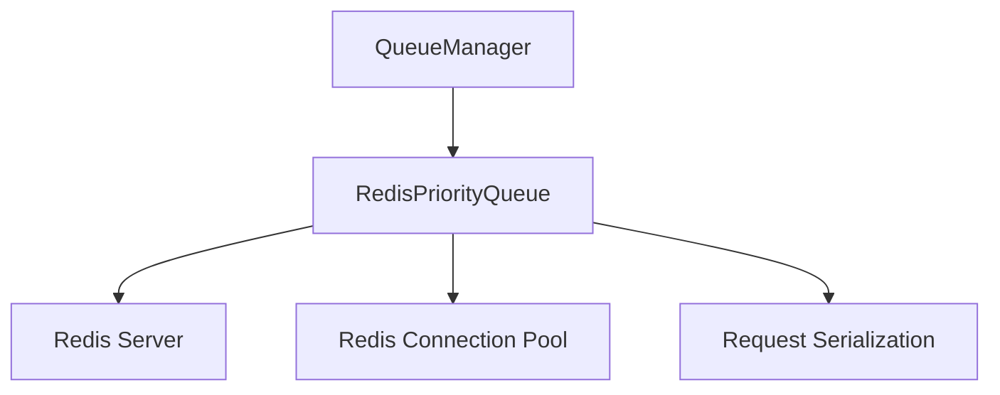

# Redis Queue

The Redis Queue is a distributed queue implementation based on Redis that enables multi-node crawling scenarios. It provides persistent, shared queue operations across multiple crawler instances.

## Overview

The Redis Queue is designed for:

- Distributed crawling (multi-node)
- Production environments
- Scenarios requiring persistence
- High availability crawling setups

## Architecture

The Redis Queue uses Redis data structures for distributed queue operations:



## Key Features

### Distributed Operation

- Shared queue across multiple nodes
- Persistent storage
- Fault tolerance
- Horizontal scaling

### Priority Support

- Priority-based request ordering
- Efficient priority queue implementation
- Configurable priority handling
- Redis sorted sets for priority management

### Performance Optimizations

- Connection pooling
- Pipeline operations
- Batch processing
- Lazy connection establishment

## Implementation Details

### RedisPriorityQueue

The main Redis queue implementation provides:

- Priority queue functionality using Redis sorted sets
- Request serialization/deserialization
- Connection management
- Error handling and retries

### Queue Operations

1. **Put**: Add request to Redis sorted set with priority
2. **Get**: Retrieve highest priority request
3. **Size**: Get current queue size
4. **Empty**: Check if queue is empty

## Configuration

The Redis Queue is configured through QueueConfig:

```python
# In settings.py or QueueConfig
QUEUE_TYPE = 'redis'
REDIS_HOST = 'localhost'
REDIS_PORT = 6379
REDIS_PASSWORD = ''
REDIS_DB = 0
SCHEDULER_QUEUE_NAME = 'crawlo:myproject:queue:requests'
QUEUE_MAX_RETRIES = 3
QUEUE_TIMEOUT = 300

# Redis-specific settings
REDIS_URL = 'redis://localhost:6379/0'
```

## API Reference

### `RedisPriorityQueue`

The main Redis queue implementation.

#### `__init__(redis_url, queue_name, max_retries=3, timeout=300)`

Creates a new RedisPriorityQueue instance.

**Parameters:**
- `redis_url`: Redis connection URL
- `queue_name`: Name of the Redis queue
- `max_retries`: Maximum retry attempts
- `timeout`: Operation timeout in seconds

#### `async put(request, priority=0)`

Adds a request to the queue.

**Parameters:**
- `request`: The request to enqueue
- `priority`: Priority level (higher numbers = higher priority)

**Returns:**
- `bool`: True if request was enqueued

#### `async get(timeout=5.0)`

Retrieves a request from the queue.

**Parameters:**
- `timeout`: Maximum time to wait for a request

**Returns:**
- The dequeued request, or None if timeout

#### `async qsize()`

Gets the current queue size.

**Returns:**
- `int`: Number of requests in the queue

#### `async empty()`

Checks if the queue is empty.

**Returns:**
- `bool`: True if queue is empty

#### `async close()`

Cleans up resources and closes connections.

## Example Usage

```python
from crawlo.queue.redis_priority_queue import RedisPriorityQueue

# Create Redis queue
queue = RedisPriorityQueue(
    redis_url='redis://localhost:6379/0',
    queue_name='crawlo:myproject:queue:requests'
)

# Add request
await queue.put(request, priority=5)

# Get request
request = await queue.get(timeout=10.0)

# Check size
size = await queue.qsize()

# Cleanup
await queue.close()
```

## Performance Considerations

### Connection Management

- Use connection pooling to reduce overhead
- Configure appropriate pool sizes
- Monitor connection usage
- Handle connection failures gracefully

### Serialization

- Request serialization adds overhead
- Use efficient serialization formats
- Minimize data size in requests
- Cache serialized data when possible

### Redis Configuration

- Optimize Redis server settings
- Use appropriate Redis data types
- Monitor Redis memory usage
- Configure Redis persistence settings

## Best Practices

1. **Connection Pooling**: Use connection pools for better performance
2. **Error Handling**: Implement robust error handling and retries
3. **Monitoring**: Monitor queue sizes and processing rates
4. **Serialization**: Optimize request serialization
5. **Cleanup**: Properly close connections and clean up resources

## When to Use Redis Queue

The Redis Queue is recommended for:

- Distributed crawling scenarios
- Production environments
- High availability requirements
- Persistent queue storage
- Multi-node deployments
- Large-scale crawling operations

It requires:

- Redis server installation and configuration
- Network connectivity to Redis server
- Proper Redis security configuration
- Monitoring and maintenance of Redis instance