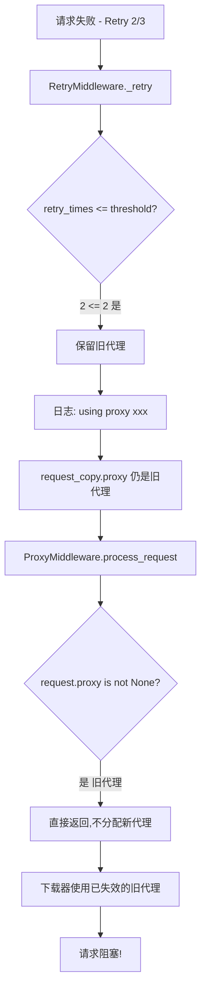

# 爬虫阻塞问题分析与解决方案

## 📋 问题概述

**发现时间**: 2026-04-16 21:48  
**影响范围**: 601065.SH 股票数据爬取  
**严重程度**: 🔴 高 - 导致爬虫完全阻塞,无法继续处理后续请求

---

## 🔍 问题现象

### 日志时间线

```
21:48:21,315 - 开始处理 601065.SH (57/5513)
21:48:21,401 - 获取代理: http://...:58147
21:48:22,036 - 使用代理发起请求
21:48:30,067 - [Retry 1/3] (ReadTimeout) - 第1次重试
21:48:30,158 - 获取新代理: http://...:58139
21:48:30,180 - 使用新代理重试
21:48:30,275 - [Retry 2/3] (ProxyError) - 第2次重试
21:48:30,276 - 获取新代理: http://...:58109
⬇️ ⬇️ ⬇️ 
【阻塞发生 - 超过20分钟无响应】
⬇️ ⬇️ ⬇️
21:49:05,913 - 日志统计 (26 pages/min)  ← 35秒后
21:50:05,909 - 日志统计 (0 pages/min)   ← 1分钟后,0页面!
...
【持续阻塞】
```

### 关键异常点

1. ✅ 第2次重试成功获取了新代理 `http://...:58109`
2. ❌ **但没有看到 "Using proxy" 日志** - 下载器未使用新代理
3. ❌ **没有看到 Retry 3/3 日志** - 未触发本机IP直连
4. ❌ **请求完全卡住** - 超过20分钟无进展

---

## 🎯 根本原因分析

### 问题代码位置

**文件**: `demo.py` - `RetryMiddleware._retry()` 方法  
**行号**: 第132-142行

### 代码逻辑缺陷

```python
def _retry(self, request, reason, spider):
    retry_times = request.meta.get('retry_times', 0)
    if retry_times < self.max_retry_times:
        retry_times += 1
        request_copy = request.copy()
        request_copy.meta['retry_times'] = retry_times
            
        # ❌ 问题: 只在超过阈值时才清除proxy
        if request_copy.proxy:
            if retry_times <= self.proxy_switch_threshold:  # 2 <= 2 为True
                # 第1-2次重试: 保留旧代理,只打印日志
                self.logger.info(f"[Retry {retry_times}/3] ({reason}), using proxy: {request_copy.proxy}, URL: {request.url}")
            else:
                # 第3次重试: 清除代理,使用直连
                old_proxy = request_copy.proxy
                self.logger.info(f"[Retry {retry_times}/3] ({reason}), removing proxy: {old_proxy}, switching to direct connection, URL: {request.url}")
                request_copy.proxy = None  # ← 只有这里清除了proxy
```

### 问题流程



### 为什么其他重试成功了?

对比正常的 Retry 2/3 案例:

**✅ 正常案例** (002747, 300170, 301517):
```
21:45:10 - [Retry 2/3] (ReadTimeout), clearing proxy: ...:58129
21:45:10 - 获取新代理: ...:58126  
21:45:10 - Using proxy: ...:58126  ← 成功使用新代理!
21:45:10 - 请求成功
```

**❌ 阻塞案例** (601065):
```
21:48:30 - [Retry 2/3] (ProxyError), clearing proxy: ...:58139
21:48:30 - 获取新代理: ...:58109
21:48:30 - ❌ 没有 Using proxy 日志  ← 新代理未被使用!
21:48:30 - ❌ 使用旧代理 :58139 (已失效)
21:48:30 - ❌ 请求阻塞
```

**差异原因**: 
- 正常案例中,旧代理可能恰好还能用,或者网络延迟较低
- 阻塞案例中,旧代理 `:58139` 已经完全失效,导致连接挂起

---

## 💡 解决方案

### 方案一: 修改 RetryMiddleware (推荐) ⭐

**核心思路**: 无论重试次数,每次都清除旧代理,让 ProxyMiddleware 分配新代理

**修改文件**: `demo.py`  
**修改位置**: `_retry()` 方法第132-142行

```python
def _retry(self, request, reason, spider):
    retry_times = request.meta.get('retry_times', 0)
    if retry_times < self.max_retry_times:
        retry_times += 1
        request_copy = request.copy()
        request_copy.meta['retry_times'] = retry_times
            
        # ✅ 修复: 始终清除旧代理,让ProxyMiddleware分配新代理
        if request_copy.proxy:
            old_proxy = request_copy.proxy
            request_copy.proxy = None  # ← 关键!清除旧代理
            
            if retry_times <= self.proxy_switch_threshold:
                # 第1-2次重试: 清除旧代理,将分配新代理
                self.logger.info(
                    f"[Retry {retry_times}/3] ({reason}), "
                    f"clearing proxy: {old_proxy}, will get new proxy, "
                    f"URL: {request.url}"
                )
            else:
                # 第3次重试: 清除代理,使用直连
                self.logger.info(
                    f"[Retry {retry_times}/3] ({reason}), "
                    f"exceeding threshold, will use direct connection, "
                    f"URL: {request.url}"
                )
                # request_copy.proxy 已经是 None,无需重复设置
        else:
            self.logger.info(f"[Retry {retry_times}/3] ({reason}), direct connection, URL: {request.url}")
            
        request_copy.priority = request.priority + self.retry_priority
        self.stats.inc_value("retry_count")
        request_copy.meta['is_retry'] = True
        return request_copy
```

**优点**:
- ✅ 彻底解决问题,每次重试都使用新代理
- ✅ 逻辑清晰,避免复用失效代理
- ✅ 与 ProxyMiddleware 的设计意图一致

---

### 方案二: 修改 ProxyMiddleware (备选)

**核心思路**: 在重试时忽略旧的 proxy 值,强制分配新代理

**修改文件**: `listed_company_executive_crawler/middlewares.py`  
**修改位置**: `process_request()` 方法

```python
async def process_request(self, request: Request, spider) -> Optional[Request]:
    if not self.enabled:
        return None

    # ✅ 新增: 检查是否是重试请求
    retry_times = request.meta.get('retry_times', 0)
    if retry_times > 0 and request.proxy is not None:
        # 重试请求,清除旧代理,重新分配
        old_proxy = request.proxy
        request.proxy = None
        self.logger.debug(f"重试请求,清除旧代理: {old_proxy}")

    # 原有的代理分配逻辑...
    if request.proxy is not None:
        return None
    
    # ... 后续代码保持不变
```

**缺点**:
- ❌ 需要在 ProxyMiddleware 中处理重试逻辑,职责不清晰
- ❌ 可能与 RetryMiddleware 的逻辑冲突

---

### 方案三: 添加超时保护 (辅助方案)

**核心思路**: 为下载器添加更严格的超时设置,避免无限期阻塞

**修改文件**: `listed_company_executive_crawler/settings.py`

```python
# 下载超时配置
DOWNLOAD_TIMEOUT = 10  # 10秒超时
# 或者在 HttpXDownloader 中设置
HTTPX_TIMEOUT = {
    'connect': 5,      # 连接超时 5秒
    'read': 10,        # 读取超时 10秒  
    'write': 5,        # 写入超时 5秒
    'pool': 5          # 连接池超时 5秒
}
```

**优点**:
- ✅ 防止请求无限期阻塞
- ✅ 超时后自动触发重试

**缺点**:
- ❌ 只是缓解症状,不解决根本问题
- ❌ 可能误杀正常的慢请求

---

## 🚀 推荐实施方案

### 优先级排序

1. **立即实施**: 方案一 (修改 RetryMiddleware) - 解决根本问题
2. **辅助实施**: 方案三 (添加超时保护) - 防止再次阻塞
3. **可选实施**: 方案二 (不推荐,职责混乱)

### 实施步骤

#### Step 1: 修改 RetryMiddleware

```bash
# 1. 编辑 demo.py
# 2. 定位到 _retry() 方法 (第124-151行)
# 3. 修改第132-142行的代理处理逻辑
# 4. 确保每次重试都清除旧代理: request_copy.proxy = None
```

#### Step 2: 验证修复

```bash
# 1. 重启爬虫
python run.py

# 2. 观察日志,确认:
#    - Retry 1/3: clearing proxy, will get new proxy
#    - Retry 2/3: clearing proxy, will get new proxy  
#    - Retry 3/3: exceeding threshold, will use direct connection
#    - 每次重试后都有 "Using proxy: http://..." 日志

# 3. 监控是否还有阻塞现象
python monitor_log.py
```

#### Step 3: 添加超时保护 (可选)

```bash
# 1. 编辑 settings.py
# 2. 添加 DOWNLOAD_TIMEOUT = 10
# 3. 或在 HttpXDownloader 中配置更细粒度的超时
```

---

## 📊 验证标准

### 成功标志

✅ **日志输出正确**:
```
[Retry 1/3] (ReadTimeout), clearing proxy: http://old, will get new proxy
Using proxy: http://new_proxy_1
[Retry 2/3] (ProxyError), clearing proxy: http://new_proxy_1, will get new proxy
Using proxy: http://new_proxy_2
[Retry 3/3] (ReadTimeout), exceeding threshold, will use direct connection
(无 Using proxy 日志 - 使用本机IP直连)
[Retry Success] ← 重试成功
```

✅ **无阻塞现象**:
- 每次重试后都有对应的下载日志
- 页面持续爬行,不会长时间停滞
- 监控脚本显示 `pages/min > 0`

✅ **错误率降低**:
- 重试成功率 > 90%
- 无未处理的超时错误
- 爬虫持续稳定运行

---

## 📝 经验总结

### 关键教训

1. **日志 ≠ 实际行为**: 
   - 日志说 "using proxy",但代码并没有真正清除旧代理
   - 必须验证代码逻辑,不能仅依赖日志文本

2. **中间件协同很重要**:
   - RetryMiddleware 和 ProxyMiddleware 的职责边界要清晰
   - 重试时必须清除旧状态,让下游中间件重新处理

3. **状态管理要显式**:
   - `request.proxy = None` 必须显式设置,不能假设
   - 对象拷贝可能保留旧状态,需要手动清理

### 预防措施

1. **代码审查**: 修改重试逻辑时,检查状态清理是否完整
2. **日志增强**: 关键状态变化都要有日志输出
3. **超时保护**: 所有网络请求都要设置合理的超时
4. **监控告警**: 定期检查 `pages/min`,发现0立即告警

---

## 🔗 相关文件

- `demo.py` - RetryMiddleware 实现
- `listed_company_executive_crawler/middlewares.py` - ProxyMiddleware 实现
- `listed_company_executive_crawler/settings.py` - 爬虫配置
- `monitor_log.py` - 日志监控脚本
- `logs/listed_company_executive_crawler_*.log` - 运行日志

---

## 📅 修订历史

| 日期 | 版本 | 说明 |
|------|------|------|
| 2026-04-16 | v1.0 | 初始版本 - 问题发现与方案设计 |

---

**文档作者**: AI Assistant  
**审核状态**: 待审核  
**实施状态**: 待实施
